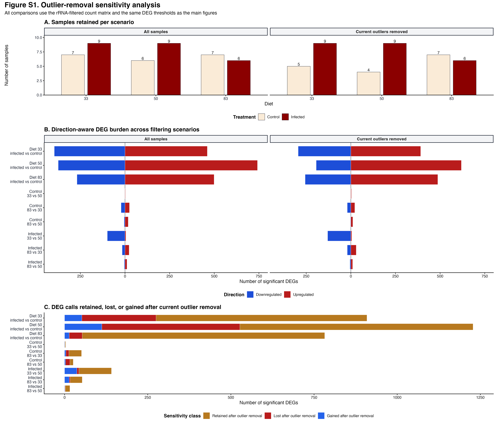

## Purpose

::: {.walkthrough-grid}
::: {.walkthrough-step}
**Step 1 - Define archived scenarios**

Start from the 44-sample cohort and define the historical reduced set only as a check.
:::
::: {.walkthrough-step}
**Step 2 - Repeat contrasts**

Apply the same transcript-plus-exon counts and DEG thresholds to both scenarios.
:::
::: {.walkthrough-step}
**Step 3 - Assess stability**

Compare PCA, DEG burden, retained calls, and fold changes.
:::
:::

The main analysis pages use the frozen 44-sample cohort, which always excludes
1044. This archived sensitivity page reruns the same within-diet infection
contrasts with and without the older candidate-outlier set so we can see whether
those additional exclusions change the biological patterns.

The no-outlier analysis is treated as a sensitivity analysis, not as a
replacement for the main analysis. This is important because the removed samples
are all controls from diet 33 or diet 50, so removing them changes group balance
as well as expression structure.

## Setup

```{r setup}
knitr::opts_chunk$set(message = FALSE, warning = FALSE)

required <- c("DESeq2", "ggplot2", "dplyr", "tidyr", "ggrepel", "DT",
              "SummarizedExperiment")
missing <- required[!vapply(required, requireNamespace, logical(1), quietly = TRUE)]
if (length(missing) > 0) {
  stop("Install required packages before knitting: ", paste(missing, collapse = ", "))
}

project_dir <- normalizePath(".", mustWork = TRUE)
run_stamp <- format(Sys.time(), "%Y%m%d-%H%M%S")
out_dir <- file.path(project_dir, "output", "rmd_runs",
                     paste(params$output_tag, run_stamp, sep = "_"))
dir.create(out_dir, recursive = TRUE, showWarnings = FALSE)

diet_colors <- c("33" = "#E6862E", "50" = "#2F8F5B", "83" = "#7B4FA3")
treatment_colors <- c("Control" = "#7B8794", "Infected" = "#C85A54")
direction_colors <- c("Higher in infected" = "#C85A54",
                      "Higher in control" = "#237C8E")
comparison_colors <- c("Retained in both" = "#2F8F5B",
                       "Lost after removing outliers" = "#C85A54",
                       "Gained after removing outliers" = "#7B4FA3")

metadata_full_file <- file.path(project_dir, params$metadata_full_file)
metadata_no_outliers_file <- file.path(project_dir, params$metadata_no_outliers_file)
counts_file <- file.path(project_dir, params$counts_file)
```

## Sample inclusion

```{r sample-inclusion}
read_metadata <- function(path) {
  tab <- read.delim(path, check.names = FALSE)
  tab <- tab[, !is.na(names(tab)) & nzchar(names(tab)), drop = FALSE]
  tab$label <- as.character(tab$label)
  tab$Diet <- factor(tab$Diet, levels = c("33", "50", "83"))
  tab$Treatment <- relevel(factor(tab$Treatment), ref = "Control")
  tab
}

metadata_full <- read_metadata(metadata_full_file)
metadata_no_outliers <- read_metadata(metadata_no_outliers_file) |>
  dplyr::filter(label != params$mandatory_exclusion)

removed_samples <- metadata_full |>
  dplyr::filter(!label %in% metadata_no_outliers$label)

knitr::kable(removed_samples, caption = "Samples removed in no-outlier metadata")

design_table <- dplyr::bind_rows(
  metadata_full |> dplyr::mutate(dataset = "44-sample cohort"),
  metadata_no_outliers |> dplyr::mutate(dataset = "Additional outliers removed")
) |>
  dplyr::count(dataset, Diet, Treatment, name = "n_samples")

knitr::kable(design_table, caption = "Sample counts by diet and treatment")

write.csv(removed_samples, file.path(out_dir, "removed_samples.csv"),
          row.names = FALSE)
write.csv(design_table, file.path(out_dir, "sample_counts_by_group.csv"),
          row.names = FALSE)
```

## Rerun within-diet infection contrasts

Each dataset is analyzed with the same rule used on the main within-diet page:
inside each diet, fit `~ Treatment` and contrast infected versus control. A gene
is called significant when `padj < alpha` and `abs(log2FoldChange) >=
lfc_threshold`.

```{r run-contrasts}
counts_raw <- read.delim(counts_file, check.names = FALSE)
counts_all <- as.matrix(counts_raw[, -1])
rownames(counts_all) <- counts_raw[[1]]
storage.mode(counts_all) <- "integer"
count_labels <- sub("_MERGE$", "", sub("^mehreen_", "", colnames(counts_all)))
colnames(counts_all) <- count_labels

run_dataset <- function(metadata, dataset_label) {
  metadata <- metadata[match(count_labels[count_labels %in% metadata$label],
                             metadata$label), ]
  metadata <- metadata[!is.na(metadata$label), ]
  rownames(metadata) <- metadata$label
  counts <- counts_all[, metadata$label, drop = FALSE]

  keep <- rowSums(counts) >= params$min_total_count
  dds_vst <- DESeq2::DESeqDataSetFromMatrix(
    countData = counts[keep, ],
    colData = metadata,
    design = ~ Diet + Treatment
  )
  vsd <- DESeq2::vst(dds_vst, blind = TRUE)
  vst_mat <- SummarizedExperiment::assay(vsd)

  pca <- prcomp(t(vst_mat), scale. = FALSE)
  percent_var <- round(100 * (pca$sdev^2 / sum(pca$sdev^2)), 1)
  pca_scores <- data.frame(
    dataset = dataset_label,
    label = rownames(pca$x),
    PC1 = pca$x[, "PC1"],
    PC2 = pca$x[, "PC2"],
    Diet = metadata$Diet,
    Treatment = metadata$Treatment,
    percent_PC1 = percent_var[1],
    percent_PC2 = percent_var[2],
    stringsAsFactors = FALSE
  )

  result_tables <- list()
  for (diet_level in levels(droplevels(metadata$Diet))) {
    sample_keep <- metadata$Diet == diet_level
    metadata_sub <- droplevels(metadata[sample_keep, ])
    counts_sub <- counts[, sample_keep, drop = FALSE]
    keep_sub <- rowSums(counts_sub) >= params$min_total_count

    dds <- DESeq2::DESeqDataSetFromMatrix(
      countData = counts_sub[keep_sub, ],
      colData = metadata_sub,
      design = ~ Treatment
    )
    dds <- DESeq2::DESeq(dds)
    res <- DESeq2::results(dds, contrast = c("Treatment", "Infected", "Control"))
    res_df <- as.data.frame(res)
    res_df$gene_id <- rownames(res_df)
    res_df$diet <- diet_level
    res_df$dataset <- dataset_label
    res_df$significant <- !is.na(res_df$padj) &
      res_df$padj < params$alpha &
      abs(res_df$log2FoldChange) >= params$lfc_threshold
    res_df$direction <- ifelse(res_df$log2FoldChange > 0,
                               "Higher in infected",
                               "Higher in control")
    result_tables[[diet_level]] <- res_df
  }

  list(
    pca_scores = pca_scores,
    results = dplyr::bind_rows(result_tables)
  )
}

full_analysis <- run_dataset(metadata_full, "44-sample cohort")
no_outlier_analysis <- run_dataset(metadata_no_outliers, "Additional outliers removed")

pca_scores_all <- dplyr::bind_rows(full_analysis$pca_scores,
                                   no_outlier_analysis$pca_scores)
contrast_results <- dplyr::bind_rows(full_analysis$results,
                                     no_outlier_analysis$results)

write.csv(pca_scores_all, file.path(out_dir, "pca_scores_full_vs_no_outliers.csv"),
          row.names = FALSE)
write.csv(contrast_results,
          file.path(out_dir, "within_diet_results_full_vs_no_outliers.csv"),
          row.names = FALSE)
```

## PCA pattern

The PCA is not a differential-expression test. It shows whether removing the
outlier samples changes the broad VST expression geometry before we interpret
gene-level contrasts.

```{r pca-comparison, fig.height=5.6, fig.width=10}
pca_scores_all$outlier_removed <- pca_scores_all$label %in% removed_samples$label

p_pca_sensitivity <- ggplot2::ggplot(
  pca_scores_all,
  ggplot2::aes(PC1, PC2, color = Diet, shape = Treatment)
) +
  ggplot2::geom_point(size = 3, alpha = 0.86) +
  ggplot2::geom_point(
    data = pca_scores_all[pca_scores_all$outlier_removed, ],
    shape = 21,
    fill = "white",
    color = "#111827",
    stroke = 1.1,
    size = 4.6
  ) +
  ggrepel::geom_label_repel(
    data = pca_scores_all[pca_scores_all$outlier_removed, ],
    ggplot2::aes(x = PC1, y = PC2, label = label),
    color = "#111827",
    fill = "white",
    size = 3,
    label.size = 0.18,
    inherit.aes = FALSE
  ) +
  ggplot2::facet_wrap(~ dataset) +
  ggplot2::scale_color_manual(values = diet_colors) +
  ggplot2::theme_classic() +
  ggplot2::theme(legend.position = "bottom") +
  ggplot2::labs(
    title = "PCA sensitivity to outlier removal",
    subtitle = "Outlined labels are samples absent from the no-outlier metadata",
    x = "PC1",
    y = "PC2",
    color = "Diet",
    shape = "Treatment"
  )

p_pca_sensitivity
ggplot2::ggsave(file.path(out_dir, "pca_full_vs_no_outliers.png"),
                p_pca_sensitivity, width = 10, height = 5.6, dpi = 300)
```

## DEG burden comparison

```{r burden-comparison, fig.height=5.2, fig.width=9}
burden <- contrast_results |>
  dplyr::filter(significant, !is.na(log2FoldChange)) |>
  dplyr::count(dataset, diet, direction, name = "n_degs") |>
  dplyr::mutate(
    diet = factor(diet, levels = c("33", "50", "83")),
    signed_n = ifelse(direction == "Higher in infected", n_degs, -n_degs)
  )

max_burden <- max(abs(burden$signed_n), 1)

p_burden <- ggplot2::ggplot(
  burden,
  ggplot2::aes(x = signed_n, y = diet, fill = direction)
) +
  ggplot2::geom_vline(xintercept = 0, color = "#374151", linewidth = 0.35) +
  ggplot2::geom_col(width = 0.68) +
  ggplot2::geom_text(
    ggplot2::aes(label = n_degs,
                 hjust = ifelse(signed_n > 0, -0.15, 1.15)),
    size = 3.1
  ) +
  ggplot2::facet_wrap(~ dataset) +
  ggplot2::scale_x_continuous(labels = abs,
                              limits = c(-1.25 * max_burden,
                                         1.25 * max_burden)) +
  ggplot2::scale_fill_manual(values = direction_colors) +
  ggplot2::theme_classic() +
  ggplot2::theme(legend.position = "bottom") +
  ggplot2::labs(
    title = "Within-diet infection DEG burden with and without outliers",
    subtitle = "Right: higher in infected; left: higher in control",
    x = "Number of significant genes",
    y = "Diet",
    fill = "Direction"
  )

p_burden
ggplot2::ggsave(file.path(out_dir, "deg_burden_full_vs_no_outliers.png"),
                p_burden, width = 9, height = 5.2, dpi = 300)
write.csv(burden, file.path(out_dir, "deg_burden_full_vs_no_outliers.csv"),
          row.names = FALSE)
```

## DEG retention, loss, and gain

This plot asks which significant DEG calls are stable after outlier removal. A
retained gene is significant in both analyses for that diet. A lost gene is
significant only in the full analysis. A gained gene is significant only after
removing the outliers.

```{r retained-lost-gained, fig.height=4.8, fig.width=8.5}
deg_membership <- contrast_results |>
  dplyr::filter(significant) |>
  dplyr::distinct(dataset, diet, gene_id)

compare_diet_sets <- function(diet_level) {
  full_set <- deg_membership |>
    dplyr::filter(dataset == "44-sample cohort", diet == diet_level) |>
    dplyr::pull(gene_id)
  no_set <- deg_membership |>
    dplyr::filter(dataset == "Additional outliers removed", diet == diet_level) |>
    dplyr::pull(gene_id)
  data.frame(
    diet = diet_level,
    status = c("Retained in both",
               "Lost after removing outliers",
               "Gained after removing outliers"),
    n_genes = c(length(intersect(full_set, no_set)),
                length(setdiff(full_set, no_set)),
                length(setdiff(no_set, full_set))),
    stringsAsFactors = FALSE
  )
}

retention_summary <- dplyr::bind_rows(
  lapply(c("33", "50", "83"), compare_diet_sets)
)
retention_summary$diet <- factor(retention_summary$diet, levels = c("33", "50", "83"))
retention_summary$status <- factor(retention_summary$status,
                                   levels = names(comparison_colors))

p_retention <- ggplot2::ggplot(
  retention_summary,
  ggplot2::aes(x = diet, y = n_genes, fill = status)
) +
  ggplot2::geom_col(position = ggplot2::position_dodge(width = 0.78),
                    width = 0.68) +
  ggplot2::geom_text(
    ggplot2::aes(label = n_genes),
    position = ggplot2::position_dodge(width = 0.78),
    vjust = -0.3,
    size = 3.1
  ) +
  ggplot2::scale_fill_manual(values = comparison_colors) +
  ggplot2::theme_classic() +
  ggplot2::theme(legend.position = "bottom") +
  ggplot2::labs(
    title = "DEG calls retained, lost, or gained after outlier removal",
    x = "Diet",
    y = "Number of genes",
    fill = NULL
  )

p_retention
ggplot2::ggsave(file.path(out_dir, "deg_retained_lost_gained.png"),
                p_retention, width = 8.5, height = 4.8, dpi = 300)
write.csv(retention_summary, file.path(out_dir, "deg_retained_lost_gained.csv"),
          row.names = FALSE)
```

## Fold-change stability

The fold-change comparison checks whether the same genes have similar
infected-control effect sizes with and without outlier removal. The key
interpretation is the slope and scatter: a tight diagonal means the effect sizes
are stable, while broad scatter means the contrast is sensitive to sample
inclusion.

```{r lfc-stability, fig.height=5.5, fig.width=9.5}
lfc_wide <- contrast_results |>
  dplyr::select(dataset, diet, gene_id, log2FoldChange, significant) |>
  dplyr::mutate(
    dataset_key = dplyr::case_when(
      dataset == "44-sample cohort" ~ "Analysis_cohort",
      dataset == "Additional outliers removed" ~ "Additional_outliers_removed",
      TRUE ~ gsub("[^A-Za-z0-9]+", "_", dataset)
    )
  ) |>
  dplyr::select(-dataset) |>
  tidyr::pivot_wider(
    names_from = dataset_key,
    values_from = c(log2FoldChange, significant),
    names_sep = "__"
  ) |>
  dplyr::mutate(
    DEG_status = dplyr::case_when(
      significant__Analysis_cohort & significant__Additional_outliers_removed ~ "Significant in both",
      significant__Analysis_cohort & !significant__Additional_outliers_removed ~ "Cohort only",
      !significant__Analysis_cohort & significant__Additional_outliers_removed ~ "Reduced set only",
      TRUE ~ "Not significant"
    )
  )

lfc_colors <- c("Significant in both" = "#2F8F5B",
                "Cohort only" = "#C85A54",
                "Reduced set only" = "#7B4FA3",
                "Not significant" = "#D1D5DB")

p_lfc <- ggplot2::ggplot(
  lfc_wide,
  ggplot2::aes(x = log2FoldChange__Analysis_cohort,
               y = log2FoldChange__Additional_outliers_removed,
               color = DEG_status)
) +
  ggplot2::geom_abline(slope = 1, intercept = 0,
                       linetype = "dashed", color = "#374151") +
  ggplot2::geom_point(alpha = 0.45, size = 0.6) +
  ggplot2::facet_wrap(~ diet) +
  ggplot2::scale_color_manual(values = lfc_colors) +
  ggplot2::theme_classic() +
  ggplot2::theme(legend.position = "bottom") +
  ggplot2::labs(
    title = "Log2 fold-change stability after outlier removal",
    x = "44-sample cohort log2FC",
    y = "Additional-outlier-removal log2FC",
    color = "DEG status"
  )

p_lfc
ggplot2::ggsave(file.path(out_dir, "log2fc_stability_full_vs_no_outliers.png"),
                p_lfc, width = 9.5, height = 5.5, dpi = 300)
write.csv(lfc_wide, file.path(out_dir, "log2fc_stability_full_vs_no_outliers.csv"),
          row.names = FALSE)
```

## Publication sensitivity panel {#Publication_figure}

The primary study retains all 44 analysis-cohort samples. Figure S1 summarizes the alternative
sample-removal scenarios as a sensitivity analysis rather than a competing
primary result.



The publication page contains the matching SVG and source tables.

```{r session-info}
writeLines(capture.output(sessionInfo()),
           file.path(out_dir, "sessionInfo.txt"))
sessionInfo()
```
