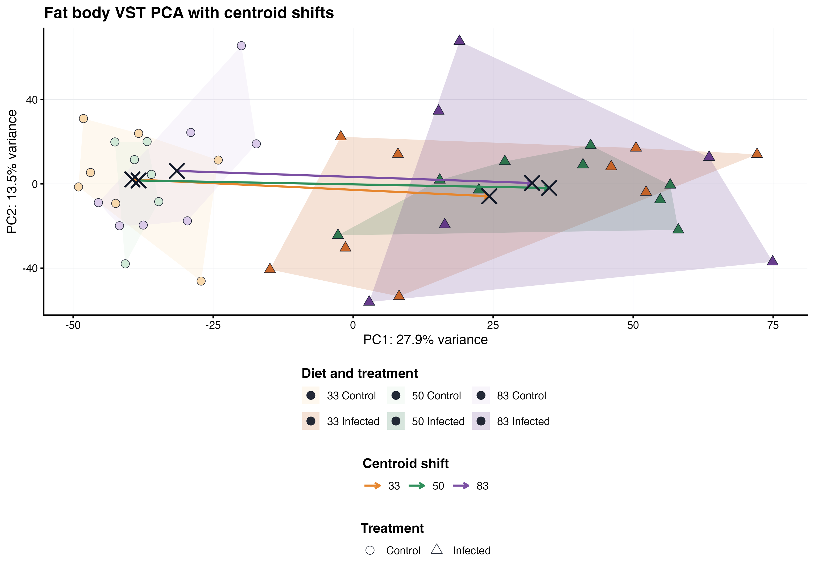

## Purpose

This is the all-samples, main-chromosome version of the interaction model. It keeps every
library in `mehreen_metadata_fixed.txt`, including the samples currently treated
as outliers in sensitivity analyses.

Only genes assigned to a nuclear chromosome in the official assembly-placement
table are tested. Annotated rRNA, mitochondrial genes, unplaced scaffolds, and
count rows without a unique official gene-placement record are excluded before
expression filtering, normalization, VST, and DESeq2.

This page fits the full model for the manuscript question: does infection
response depend on diet?

This is the most formal model in the site because it uses all samples together
and estimates diet, infection, and diet-by-infection terms in one DESeq2 design.
The interaction terms are especially important: they ask whether the infected
versus control response changes when diet changes, rather than assuming one
single infection response across all diets.

The default DESeq2 design is:

```{r design-formula, eval=FALSE}
~ Diet + Treatment + Diet:Treatment
```

## Setup and data loading

The metadata are matched to the count matrix by sample label before modelling.
The reference diet and treatment are set in the YAML header so the same page can
be rerun with a different baseline if needed. With the current settings, the
main infection coefficient is interpreted in the reference diet, and the
interaction coefficients describe how other diets differ from that baseline
infection response.

```{r setup}
knitr::opts_chunk$set(message = FALSE, warning = FALSE)

required <- c("DESeq2", "ggplot2", "EnhancedVolcano", "pheatmap", "readr", "dplyr")
missing <- required[!vapply(required, requireNamespace, logical(1), quietly = TRUE)]
if (length(missing) > 0) {
  stop("Install required packages before knitting: ", paste(missing, collapse = ", "))
}

coefficient_colors <- c("Positive coefficient" = "#237C8E",
                        "Negative coefficient" = "#B8643C")

project_dir <- normalizePath(".", mustWork = TRUE)
run_stamp <- format(Sys.time(), "%Y%m%d-%H%M%S")
out_dir <- file.path(project_dir, "output", "rmd_runs",
                     paste(params$output_tag, run_stamp, sep = "_"))
dir.create(out_dir, recursive = TRUE, showWarnings = FALSE)

metadata <- read.delim(file.path(project_dir, params$metadata_file),
                       check.names = FALSE)
metadata$label <- as.character(metadata$label)
metadata$Diet <- relevel(factor(metadata$Diet), ref = params$reference_diet)
metadata$Treatment <- relevel(factor(metadata$Treatment),
                              ref = params$reference_treatment)

counts_table <- readr::read_tsv(file.path(project_dir, params$counts_file),
                                show_col_types = FALSE)
stopifnot("gene_id" %in% names(counts_table))
counts <- as.matrix(counts_table[, setdiff(names(counts_table), "gene_id")])
rownames(counts) <- counts_table$gene_id
storage.mode(counts) <- "integer"

count_labels_all <- sub("_MERGE$", "", sub("^mehreen_", "", colnames(counts)))
keep_samples <- count_labels_all %in% metadata$label
counts <- counts[, keep_samples, drop = FALSE]
count_labels <- count_labels_all[keep_samples]
metadata <- metadata[match(count_labels, metadata$label), ]
stopifnot(identical(metadata$label, count_labels))
rownames(metadata) <- metadata$label
colnames(counts) <- count_labels

placement <- readr::read_tsv(file.path(project_dir, params$placement_file),
                             show_col_types = FALSE) |>
  dplyr::distinct(gene_id, .keep_all = TRUE)
rrna_ids <- trimws(readLines(file.path(project_dir, params$rrna_file), warn = FALSE))
rrna_ids <- rrna_ids[nzchar(rrna_ids) & !startsWith(rrna_ids, "#")]
main_chromosome_ids <- placement$gene_id[
  placement$sequence_class == "Nuclear chromosome" &
    !placement$gene_id %in% rrna_ids
]
matched_ids <- intersect(rownames(counts), main_chromosome_ids)
counts <- counts[matched_ids, , drop = FALSE]

keep <- rowSums(counts >= params$min_count) >= params$min_samples
input_audit <- data.frame(
  samples_retained = ncol(counts),
  raw_count_rows = nrow(counts_table),
  main_chromosome_non_rRNA_rows = nrow(counts),
  genes_entering_DESeq2 = sum(keep)
)
knitr::kable(input_audit, caption = "Main-chromosome analysis input audit")
write.csv(input_audit, file.path(out_dir, "main_chromosome_input_audit.csv"),
          row.names = FALSE)
```

## Fit full interaction model

DESeq2 estimates gene-level dispersion and fold-change parameters from raw
counts after normalization for library size. The model includes both main
effects and interaction terms so that diet differences, infection differences,
and diet-specific infection responses can be inspected from the same fitted
object.

```{r fit-model}
dds <- DESeq2::DESeqDataSetFromMatrix(
  countData = counts[keep, ],
  colData = metadata,
  design = ~ Diet + Treatment + Diet:Treatment
)

dds <- DESeq2::DESeq(dds, minReplicatesForReplace = Inf, quiet = TRUE)
model_coefficients <- DESeq2::resultsNames(dds)
knitr::kable(data.frame(coefficient = model_coefficients))

writeLines(model_coefficients, file.path(out_dir, "deseq2_coefficients.txt"))
```

## Export model coefficients

Each non-intercept coefficient is exported as a full gene-level table. Keeping
all coefficients, rather than only significant genes, makes it possible to
change thresholds later, compare ranked genes, and reuse the same outputs for
overlap and enrichment.

```{r export-results}
extract_result <- function(coef_name) {
  # Each coefficient is written as a table so it can be inspected or reused.
  res <- DESeq2::results(dds, name = coef_name, alpha = params$alpha,
                         cooksCutoff = FALSE)
  res_df <- as.data.frame(res)
  res_df$gene_id <- rownames(res_df)
  res_df$coefficient <- coef_name
  res_df$significant <- !is.na(res_df$padj) &
    res_df$padj < params$alpha &
    abs(res_df$log2FoldChange) >= params$lfc_threshold
  res_df
}

all_results <- do.call(rbind, lapply(model_coefficients[-1], extract_result))

write.csv(all_results, file.path(out_dir, "all_model_coefficients.csv"),
          row.names = FALSE)

summary_by_coef <- aggregate(significant ~ coefficient, all_results, sum)
names(summary_by_coef)[2] <- "n_significant_genes"
knitr::kable(summary_by_coef)

write.csv(summary_by_coef, file.path(out_dir, "significant_gene_counts.csv"),
          row.names = FALSE)
```

## DEG count barplot

The coefficient table above is exact, but a barplot makes the model easier to
scan. Positive and negative coefficients are shown separately because the
biological interpretation of the sign depends on the coefficient being read:
main diet effects, the main infection effect, and interaction effects each have
their own baseline.

```{r coefficient-deg-barplot, fig.height=5.2, fig.width=8.5}
sig_model <- all_results[all_results$significant &
                           !is.na(all_results$log2FoldChange), ]
sig_model$coefficient <- factor(sig_model$coefficient,
                                levels = model_coefficients[-1])
sig_model$direction <- ifelse(sig_model$log2FoldChange > 0,
                              "Positive coefficient",
                              "Negative coefficient")
sig_model$direction <- factor(sig_model$direction,
                              levels = c("Positive coefficient",
                                         "Negative coefficient"))

coef_bar_counts <- as.data.frame(table(
  coefficient = sig_model$coefficient,
  direction = sig_model$direction
))
names(coef_bar_counts)[3] <- "n_significant_genes"

p_coef_counts <- ggplot2::ggplot(
  coef_bar_counts,
  ggplot2::aes(x = coefficient, y = n_significant_genes, fill = direction)
) +
  ggplot2::geom_col(position = ggplot2::position_dodge(width = 0.78),
                    width = 0.68) +
  ggplot2::geom_text(
    ggplot2::aes(label = n_significant_genes),
    position = ggplot2::position_dodge(width = 0.78),
    vjust = -0.35,
    size = 3
  ) +
  ggplot2::scale_fill_manual(values = coefficient_colors) +
  ggplot2::theme_classic() +
  ggplot2::theme(axis.text.x = ggplot2::element_text(angle = 35, hjust = 1)) +
  ggplot2::labs(
    title = "Significant genes by model coefficient",
    x = "DESeq2 coefficient",
    y = "Number of significant genes",
    fill = "Coefficient sign"
  )

p_coef_counts
ggplot2::ggsave(file.path(out_dir, "interaction_model_deg_count_barplot.png"),
                p_coef_counts, width = 8.5, height = 5.2, dpi = 300)
write.csv(coef_bar_counts,
          file.path(out_dir, "interaction_model_direction_counts.csv"),
          row.names = FALSE)
```

## Main infection effect

This section pulls out the infection coefficient for the reference diet. It is
useful as a baseline, but it should not be read as the infection response for
every diet when interaction terms are present.

```{r main-infection-effect}
main_effect <- grep("^Treatment_", model_coefficients, value = TRUE)[1]
if (is.na(main_effect)) {
  stop("No Treatment coefficient found. Check resultsNames(dds).")
}

main_res <- subset(all_results, coefficient == main_effect)
main_res <- main_res[order(main_res$padj), ]
head(main_res)
```

```{r volcano-main-effect, fig.height=7, fig.width=8}
EnhancedVolcano::EnhancedVolcano(
  main_res,
  lab = main_res$gene_id,
  x = "log2FoldChange",
  y = "padj",
  pCutoff = params$alpha,
  FCcutoff = params$lfc_threshold,
  title = paste("Main infection effect:", main_effect),
  subtitle = "Reference diet only unless interaction terms are added"
)
```

## Interaction coefficients

Interaction coefficients are the direct test of whether infection behaves
differently under another diet relative to the reference diet. These genes are
often the most relevant to the diet-infection interaction question, even when
the main infection effect is large.

```{r interaction-coefficients}
interaction_results <- all_results[grepl("\\.Treatment|Treatment.*Diet|Diet.*Treatment",
                                         all_results$coefficient), ]

if (nrow(interaction_results) == 0) {
  message("No interaction coefficients matched the default pattern.")
} else {
  interaction_summary <- aggregate(significant ~ coefficient,
                                   interaction_results, sum)
  names(interaction_summary)[2] <- "n_significant_interaction_genes"
  knitr::kable(interaction_summary)
  write.csv(interaction_results,
            file.path(out_dir, "interaction_coefficients.csv"),
            row.names = FALSE)
}
```

## VST PCA after model fitting

After fitting the model, the VST PCA provides a final sample-level check on the
same filtered genes that entered the model. This plot helps connect the
gene-wise coefficient results to the global expression structure across diet and
infection groups.

```{r pca}
vsd <- DESeq2::vst(dds, blind = FALSE)
pca_df <- DESeq2::plotPCA(vsd, intgroup = c("Diet", "Treatment"),
                          returnData = TRUE)
percent_var <- round(100 * attr(pca_df, "percentVar"))

p_pca <- ggplot2::ggplot(pca_df, ggplot2::aes(PC1, PC2,
                                              color = Diet,
                                              shape = Treatment)) +
  ggplot2::geom_point(size = 3) +
  ggplot2::theme_classic() +
  ggplot2::labs(
    title = "PCA after variance-stabilizing transformation",
    x = paste0("PC1: ", percent_var[1], "% variance"),
    y = paste0("PC2: ", percent_var[2], "% variance")
  )

p_pca
ggplot2::ggsave(file.path(out_dir, "interaction_model_pca.png"),
                p_pca, width = 7, height = 5, dpi = 300)
```

## Publication figure {#Publication_figure}

The manuscript-facing PCA below is generated from this placed-chromosome,
all-sample expression matrix. It adds treatment centroids and diet-specific
centroid shifts while leaving individual sample labels out of the panel. The
same export is compiled with the other manuscript panels on the
[publication figure page](08-publication-figures.html#Figure_1:_fat_body_transcriptome_PCA).



```{r session-info}
writeLines(capture.output(sessionInfo()),
           file.path(out_dir, "sessionInfo.txt"))
sessionInfo()
```
