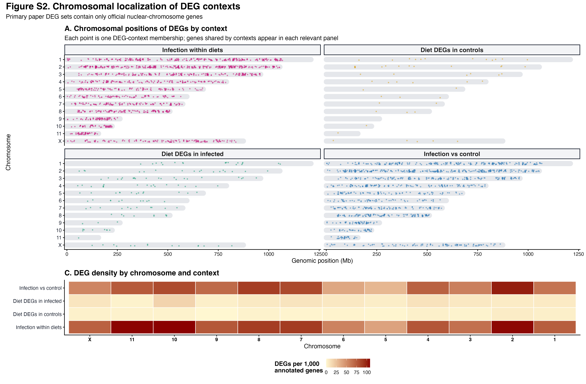

## Purpose

This page is the canonical exon-only counterpart to the primary
transcript-plus-exon analysis. It changes only the featureCounts definition to
`-t exon -g gene_id`; sample retention, competitive mapping, rRNA exclusion,
assembly placement, expression filtering, DESeq2 models, contrasts, and
significance thresholds remain identical.

::: {.walkthrough-grid}
::: {.walkthrough-step}
**Step 1 - Classify loci**

Use the official assembly report to separate main chromosomes and unplaced scaffolds.
:::
::: {.walkthrough-step}
**Step 2 - Refit models**

Run matched 44-sample DESeq2 analyses for the full and conservative gene universes.
:::
::: {.walkthrough-step}
**Step 3 - Compare results**

Quantify which DEG patterns depend on unresolved sequence placement.
:::
:::

The primary biological question concerns the *Schistocerca gregaria* fat body,
but the reference assembly contains both chromosome-assigned genes and genes on
unplaced scaffolds. A subset of unplaced scaffolds contributed a large,
coordinated expression block, especially to the infected diet 33 versus diet 50
contrast. Independent Kraken2, NCBI FCS, cross-*Schistocerca*, BLASTn, and
DIAMOND checks did not prove that this block is contamination, but they also did
not resolve the origin of every scaffold.

This page therefore uses a conservative two-part analysis:

1. **Main-chromosome analysis:** genes assigned by the official assembly
   metadata to the nuclear chromosomes are tested as the conservative host-gene
   hypothesis family used for direct comparison with the manuscript analysis.
2. **All-scaffold sensitivity analysis:** genes on officially unplaced scaffolds
   are tested separately. Their normalization factors are inherited from the
   placed host genes so a condition-specific unplaced block cannot define the
   library-size correction.

The 44-library analysis cohort retains every valid library except 1044, which
was excluded after the mapping-QC assessment. Annotated rRNA loci are removed
before modeling.

> **Interpretation boundary:** “unplaced” describes assembly placement, not
> biological origin. Unplaced genes are preserved in the outputs and in the
> focused cluster 1 verification section; they are not presented as confirmed
> microbial genes.

## Setup

```{r setup}
knitr::opts_chunk$set(message = FALSE, warning = FALSE)

required <- c(
  "DESeq2", "SummarizedExperiment", "dplyr", "readr", "tidyr", "tibble", "ggplot2",
  "pheatmap", "DT", "knitr", "scales", "stringr"
)
missing <- required[!vapply(required, requireNamespace, logical(1), quietly = TRUE)]
if (length(missing) > 0) {
  stop("Install required packages before knitting: ", paste(missing, collapse = ", "))
}

project_dir <- normalizePath(".", mustWork = TRUE)
input_path <- function(path) file.path(project_dir, path)

input_files <- c(
  primary_counts = input_path(params$primary_counts),
  host_only_counts = input_path(params$host_only_counts),
  metadata = input_path(params$metadata),
  rrna_list = input_path(params$rrna_list),
  placement = input_path(params$placement),
  previous_fresh_results = input_path(params$previous_fresh_results),
  cluster_assignments = input_path(params$cluster_assignments),
  homology_evidence = input_path(params$homology_evidence)
)
if (!all(file.exists(input_files))) {
  stop("Missing analysis input(s): ", paste(names(input_files)[!file.exists(input_files)], collapse = ", "))
}

run_stamp <- format(Sys.time(), "%Y%m%d-%H%M%S")
out_dir <- file.path(
  project_dir, "output", "rmd_runs",
  paste(params$output_tag, run_stamp, sep = "_")
)
dir.create(out_dir, recursive = TRUE, showWarnings = FALSE)

alpha <- as.numeric(params$alpha)
lfc_threshold <- as.numeric(params$lfc_threshold)
min_count <- as.integer(params$min_count)
min_samples <- as.integer(params$min_samples)

diet_colors <- c("33" = "#D9822B", "50" = "#2E8B57", "83" = "#7B4FA3")
condition_colors <- c(
  "Control 33" = "#F4C892", "Control 50" = "#A8D8B9", "Control 83" = "#C6AFD8",
  "Infected 33" = "#C65F18", "Infected 50" = "#176B43", "Infected 83" = "#633584"
)
direction_colors <- c("Higher in numerator" = "#D73027", "Higher in denominator" = "#2878B5")
scope_colors <- c(
  "Placed/host-assigned" = "#356859",
  "Unplaced scaffold" = "#9A5B68"
)

write_tsv_out <- function(x, filename) {
  readr::write_tsv(x, file.path(out_dir, filename), na = "")
}
write_csv_out <- function(x, filename) {
  readr::write_csv(x, file.path(out_dir, filename), na = "")
}
```

## Inputs and official placement classes

The two count matrices came from the same freshly rerun libraries. The primary
matrix is from competitive alignment against the locust and *Metarhizium*
references. The host-only matrix is retained as a mapping sensitivity check.
Placement is read from the assembly-report-derived gene table rather than
inferred from scaffold-name patterns.

```{r read-inputs}
read_count_matrix <- function(path) {
  table <- readr::read_tsv(path, show_col_types = FALSE)
  if (!"gene_id" %in% names(table)) stop("Count matrix lacks gene_id: ", path)
  ids <- as.character(table$gene_id)
  matrix <- as.matrix(table[, setdiff(names(table), "gene_id")])
  storage.mode(matrix) <- "integer"
  rownames(matrix) <- ids
  matrix
}

metadata <- readr::read_tsv(input_files[["metadata"]], show_col_types = FALSE) |>
  dplyr::transmute(
    sample_id = as.character(.data$label),
    diet = factor(as.character(.data$Diet), levels = c("50", "33", "83")),
    treatment = factor(as.character(.data$Treatment), levels = c("Control", "Infected"))
  ) |>
  dplyr::mutate(
    condition = factor(
      paste(.data$treatment, .data$diet),
      levels = c("Control 33", "Control 50", "Control 83", "Infected 33", "Infected 50", "Infected 83")
    ),
    group = factor(
      paste0("diet", .data$diet, "_", tolower(.data$treatment)),
      levels = c(
        "diet50_control", "diet33_control", "diet83_control",
        "diet50_infected", "diet33_infected", "diet83_infected"
      )
    )
  )

competitive_counts_raw <- read_count_matrix(input_files[["primary_counts"]])
host_only_counts_raw <- read_count_matrix(input_files[["host_only_counts"]])

if (!setequal(metadata$sample_id, colnames(competitive_counts_raw))) {
  stop("Metadata and competitive-host counts have different sample IDs.")
}
metadata <- metadata |>
  dplyr::arrange(match(.data$sample_id, colnames(competitive_counts_raw)))
competitive_counts_raw <- competitive_counts_raw[, metadata$sample_id, drop = FALSE]
host_only_counts_raw <- host_only_counts_raw[, metadata$sample_id, drop = FALSE]

placement <- readr::read_tsv(input_files[["placement"]], show_col_types = FALSE) |>
  dplyr::distinct(.data$gene_id, .keep_all = TRUE) |>
  dplyr::mutate(
    analysis_scope = dplyr::case_when(
      .data$sequence_class == "Unplaced scaffold" ~ "Unplaced scaffold",
      .data$sequence_class == "Nuclear chromosome" ~ "Placed/host-assigned",
      TRUE ~ NA_character_
    ),
    analysis_scope = factor(
      .data$analysis_scope,
      levels = c("Placed/host-assigned", "Unplaced scaffold")
    )
  )

rrna_ids <- unique(trimws(readLines(input_files[["rrna_list"]], warn = FALSE)))
rrna_ids <- rrna_ids[nzchar(rrna_ids) & !startsWith(rrna_ids, "#")]

prepare_branch_counts <- function(counts, branch) {
  placement_ids <- intersect(rownames(counts), placement$gene_id)
  valid_scope_ids <- placement$gene_id[!is.na(placement$analysis_scope)]
  retained_ids <- setdiff(intersect(placement_ids, valid_scope_ids), rrna_ids)
  filtered <- counts[retained_ids, , drop = FALSE]
  scope <- placement$analysis_scope[match(rownames(filtered), placement$gene_id)]
  if (anyNA(scope)) stop("Some placement-matched genes lack an analysis scope in ", branch)
  list(
    counts = filtered,
    scope = as.character(scope),
    input_rows = nrow(counts),
    placement_matched = length(placement_ids),
    excluded_rrna = sum(placement_ids %in% rrna_ids),
    unmatched_rows = nrow(counts) - length(placement_ids)
  )
}

competitive_prepared <- prepare_branch_counts(competitive_counts_raw, "competitive-host")
host_only_prepared <- prepare_branch_counts(host_only_counts_raw, "host-only")

input_audit <- dplyr::bind_rows(
  tibble::tibble(
    mapping_branch = "Competitive host",
    input_count_rows = competitive_prepared$input_rows,
    official_gene_ids_matched = competitive_prepared$placement_matched,
    annotated_rrna_ids_removed = competitive_prepared$excluded_rrna,
    unmatched_count_rows_excluded = competitive_prepared$unmatched_rows,
    genes_after_filters = nrow(competitive_prepared$counts)
  ),
  tibble::tibble(
    mapping_branch = "Host only",
    input_count_rows = host_only_prepared$input_rows,
    official_gene_ids_matched = host_only_prepared$placement_matched,
    annotated_rrna_ids_removed = host_only_prepared$excluded_rrna,
    unmatched_count_rows_excluded = host_only_prepared$unmatched_rows,
    genes_after_filters = nrow(host_only_prepared$counts)
  )
)
write_tsv_out(input_audit, "input_and_gene_id_filter_audit.tsv")
knitr::kable(input_audit, caption = "Fresh count-matrix and official gene-ID audit")
```

The unmatched count rows are excluded because they do not have a unique record
in the official gene-placement table. Most are repeated noncoding locus labels
made unique during matrix merging. This filtering is independent of expression,
diet, infection status, or differential-expression significance.

```{r placement-background}
placement_background <- placement |>
  dplyr::filter(!is.na(.data$analysis_scope), !.data$gene_id %in% rrna_ids) |>
  dplyr::count(.data$analysis_scope, .data$sequence_class, name = "annotated_genes")

expressed_background <- tibble::tibble(
  gene_id = rownames(competitive_prepared$counts),
  analysis_scope = competitive_prepared$scope,
  expressed = rowSums(competitive_prepared$counts >= min_count) >= min_samples
) |>
  dplyr::left_join(
    placement |>
      dplyr::select("gene_id", "sequence_class"),
    by = "gene_id"
  ) |>
  dplyr::group_by(.data$analysis_scope, .data$sequence_class) |>
  dplyr::summarise(
    genes_after_rrna_removal = dplyr::n(),
    genes_entering_deseq2 = sum(.data$expressed),
    .groups = "drop"
  )

placement_summary <- placement_background |>
  dplyr::full_join(expressed_background, by = c("analysis_scope", "sequence_class")) |>
  dplyr::arrange(.data$analysis_scope, .data$sequence_class)
write_tsv_out(placement_summary, "placement_background_summary.tsv")
knitr::kable(placement_summary, caption = "Official placement classes and expressed backgrounds")

placement_plot_data <- placement_summary |>
  dplyr::select("analysis_scope", "sequence_class", "annotated_genes", "genes_entering_deseq2") |>
  tidyr::pivot_longer(
    cols = c("annotated_genes", "genes_entering_deseq2"),
    names_to = "gene_set",
    values_to = "genes"
  ) |>
  dplyr::mutate(
    gene_set = factor(
      .data$gene_set,
      levels = c("annotated_genes", "genes_entering_deseq2"),
      labels = c("Annotated non-rRNA", "Expression-filtered")
    )
  )

ggplot2::ggplot(
  placement_plot_data,
  ggplot2::aes(x = .data$sequence_class, y = .data$genes, fill = .data$analysis_scope)
) +
  ggplot2::geom_col(width = 0.72) +
  ggplot2::facet_wrap(ggplot2::vars(.data$gene_set), scales = "free_y") +
  ggplot2::scale_fill_manual(values = scope_colors) +
  ggplot2::scale_y_continuous(labels = scales::comma) +
  ggplot2::labs(
    title = "Host genes are separated using official assembly placement",
    x = NULL, y = "Genes", fill = NULL
  ) +
  ggplot2::theme_bw(base_size = 13) +
  ggplot2::theme(
    axis.text.x = ggplot2::element_text(angle = 18, hjust = 1),
    legend.position = "bottom"
  )
```

## DESeq2 models

The same group design is used for both scopes and both mapping branches:
`~ 0 + diet:treatment`. This parameterization gives direct, reproducible linear
contrasts for infection within each diet, diet among controls, diet among
infected animals, the average infection response, and diet-by-infection
interactions.

For each mapping branch, size factors are estimated from the placed host genes.
Those factors are then supplied unchanged to the unplaced-gene model. Thus the
unplaced expression block is tested, but cannot redefine sample normalization.

```{r deseq-functions}
pair_contrast <- function(id, family, numerator, denominator, numerator_label, denominator_label) {
  list(
    id = id,
    family = family,
    numerator = numerator_label,
    denominator = denominator_label,
    weights = stats::setNames(c(1, -1), c(numerator, denominator))
  )
}

contrast_definitions <- list(
  pair_contrast("infection_diet33", "Infection within diet", "diet33_infected", "diet33_control", "Infected diet 33", "Control diet 33"),
  pair_contrast("infection_diet50", "Infection within diet", "diet50_infected", "diet50_control", "Infected diet 50", "Control diet 50"),
  pair_contrast("infection_diet83", "Infection within diet", "diet83_infected", "diet83_control", "Infected diet 83", "Control diet 83"),
  pair_contrast("control_diet33_vs50", "Diet among controls", "diet33_control", "diet50_control", "Control diet 33", "Control diet 50"),
  pair_contrast("control_diet83_vs50", "Diet among controls", "diet83_control", "diet50_control", "Control diet 83", "Control diet 50"),
  pair_contrast("control_diet83_vs33", "Diet among controls", "diet83_control", "diet33_control", "Control diet 83", "Control diet 33"),
  pair_contrast("infected_diet33_vs50", "Diet among infected", "diet33_infected", "diet50_infected", "Infected diet 33", "Infected diet 50"),
  pair_contrast("infected_diet83_vs50", "Diet among infected", "diet83_infected", "diet50_infected", "Infected diet 83", "Infected diet 50"),
  pair_contrast("infected_diet83_vs33", "Diet among infected", "diet83_infected", "diet33_infected", "Infected diet 83", "Infected diet 33"),
  list(
    id = "infection_average_all_diets", family = "Average infection response",
    numerator = "Average infected", denominator = "Average control",
    weights = c(
      diet33_infected = 1 / 3, diet50_infected = 1 / 3, diet83_infected = 1 / 3,
      diet33_control = -1 / 3, diet50_control = -1 / 3, diet83_control = -1 / 3
    )
  ),
  list(
    id = "interaction_diet33_vs50", family = "Diet by infection interaction",
    numerator = "Infection response diet 33", denominator = "Infection response diet 50",
    weights = c(diet33_infected = 1, diet33_control = -1, diet50_infected = -1, diet50_control = 1)
  ),
  list(
    id = "interaction_diet83_vs50", family = "Diet by infection interaction",
    numerator = "Infection response diet 83", denominator = "Infection response diet 50",
    weights = c(diet83_infected = 1, diet83_control = -1, diet50_infected = -1, diet50_control = 1)
  ),
  list(
    id = "interaction_diet83_vs33", family = "Diet by infection interaction",
    numerator = "Infection response diet 83", denominator = "Infection response diet 33",
    weights = c(diet83_infected = 1, diet83_control = -1, diet33_infected = -1, diet33_control = 1)
  )
)

fit_scope <- function(counts, metadata, mapping_branch, analysis_scope, supplied_size_factors = NULL) {
  keep <- rowSums(counts >= min_count) >= min_samples
  analysis_counts <- counts[keep, , drop = FALSE]
  if (nrow(analysis_counts) == 0) stop("No genes passed expression filtering for ", analysis_scope)

  dds <- DESeq2::DESeqDataSetFromMatrix(
    countData = analysis_counts,
    colData = as.data.frame(metadata),
    design = ~ 0 + group
  )
  if (!is.null(supplied_size_factors)) {
    DESeq2::sizeFactors(dds) <- supplied_size_factors[colnames(dds)]
  }
  dds <- DESeq2::DESeq(
    dds,
    minReplicatesForReplace = Inf,
    quiet = TRUE
  )

  coefficient_names <- DESeq2::resultsNames(dds)
  result_rows <- vector("list", length(contrast_definitions))
  summary_rows <- vector("list", length(contrast_definitions))

  for (index in seq_along(contrast_definitions)) {
    definition <- contrast_definitions[[index]]
    contrast_vector <- stats::setNames(rep(0, length(coefficient_names)), coefficient_names)
    requested_names <- paste0("group", names(definition$weights))
    if (!all(requested_names %in% coefficient_names)) {
      stop("Missing group coefficient(s) for ", definition$id)
    }
    contrast_vector[requested_names] <- unname(definition$weights)

    result <- DESeq2::results(
      dds,
      contrast = contrast_vector,
      alpha = alpha,
      cooksCutoff = FALSE
    ) |>
      as.data.frame() |>
      tibble::rownames_to_column("gene_id") |>
      tibble::as_tibble() |>
      dplyr::mutate(
        mapping_branch = mapping_branch,
        analysis_scope = analysis_scope,
        contrast_id = definition$id,
        contrast_family = definition$family,
        numerator = definition$numerator,
        denominator = definition$denominator,
        higher_in = dplyr::case_when(
          is.na(.data$log2FoldChange) ~ NA_character_,
          .data$log2FoldChange >= 0 ~ definition$numerator,
          TRUE ~ definition$denominator
        ),
        direction = dplyr::case_when(
          is.na(.data$log2FoldChange) ~ NA_character_,
          .data$log2FoldChange >= 0 ~ "Higher in numerator",
          TRUE ~ "Higher in denominator"
        ),
        significant = !is.na(.data$padj) &
          .data$padj < alpha &
          abs(.data$log2FoldChange) >= lfc_threshold
      )

    result_rows[[index]] <- result
    summary_rows[[index]] <- tibble::tibble(
      mapping_branch = mapping_branch,
      analysis_scope = analysis_scope,
      contrast_id = definition$id,
      contrast_family = definition$family,
      numerator = definition$numerator,
      denominator = definition$denominator,
      tested_genes = nrow(result),
      higher_in_numerator = sum(result$significant & result$log2FoldChange > 0, na.rm = TRUE),
      higher_in_denominator = sum(result$significant & result$log2FoldChange < 0, na.rm = TRUE),
      total_degs = sum(result$significant, na.rm = TRUE)
    )
  }

  list(
    dds = dds,
    results = dplyr::bind_rows(result_rows),
    summary = dplyr::bind_rows(summary_rows),
    expression_filter = keep
  )
}

fit_branch <- function(prepared, mapping_branch) {
  placed_ids <- rownames(prepared$counts)[prepared$scope == "Placed/host-assigned"]
  unplaced_ids <- rownames(prepared$counts)[prepared$scope == "Unplaced scaffold"]
  placed_fit <- fit_scope(
    prepared$counts[placed_ids, , drop = FALSE], metadata,
    mapping_branch, "Placed/host-assigned"
  )
  placed_size_factors <- DESeq2::sizeFactors(placed_fit$dds)
  unplaced_fit <- fit_scope(
    prepared$counts[unplaced_ids, , drop = FALSE], metadata,
    mapping_branch, "Unplaced scaffold", placed_size_factors
  )
  list(placed = placed_fit, unplaced = unplaced_fit)
}
```

```{r run-deseq2}
competitive_fit <- fit_branch(competitive_prepared, "Competitive host")
host_only_fit <- fit_branch(host_only_prepared, "Host only")

all_results <- dplyr::bind_rows(
  competitive_fit$placed$results,
  competitive_fit$unplaced$results,
  host_only_fit$placed$results,
  host_only_fit$unplaced$results
) |>
  dplyr::left_join(
    placement |>
      dplyr::select(
        "gene_id", "seqid", "description", "gene_biotype",
        "sequence_class", "assigned_molecule", "location_type"
      ),
    by = "gene_id"
  )

all_summary <- dplyr::bind_rows(
  competitive_fit$placed$summary,
  competitive_fit$unplaced$summary,
  host_only_fit$placed$summary,
  host_only_fit$unplaced$summary
)

write_csv_out(all_results, "placed_unplaced_all_deseq2_results.csv")
write_tsv_out(all_summary, "placed_unplaced_contrast_summary.tsv")
write_tsv_out(
  tibble::tibble(
    sample_id = names(DESeq2::sizeFactors(competitive_fit$placed$dds)),
    placed_gene_size_factor = unname(DESeq2::sizeFactors(competitive_fit$placed$dds))
  ),
  "competitive_host_placed_gene_size_factors.tsv"
)
```

## Primary placed-gene results

```{r placed-deg-summary}
primary_summary <- competitive_fit$placed$summary |>
  dplyr::arrange(.data$contrast_family, .data$contrast_id)
knitr::kable(
  primary_summary |>
    dplyr::select(
      "contrast_family", "contrast_id", "numerator", "denominator",
      "tested_genes", "higher_in_numerator", "higher_in_denominator", "total_degs"
    ),
  caption = "Primary competitively mapped, placed-host DEG results"
)
```

Positive log2 fold-changes mean higher expression in the listed numerator;
negative values mean higher expression in the denominator. This direction is
stored explicitly for every result row in the downloadable catalogue.

```{r placed-deg-catalogue}
primary_catalogue <- all_results |>
  dplyr::filter(
    .data$mapping_branch == "Competitive host",
    .data$analysis_scope == "Placed/host-assigned",
    .data$significant
  ) |>
  dplyr::select(
    "gene_id", "description", "gene_biotype", "sequence_class", "seqid",
    "contrast_family", "contrast_id", "numerator", "denominator",
    "log2FoldChange", "padj", "higher_in"
  ) |>
  dplyr::arrange(.data$contrast_family, .data$contrast_id, .data$padj, .data$gene_id)

write_csv_out(primary_catalogue, "primary_placed_host_deg_catalogue.csv")

DT::datatable(
  primary_catalogue,
  rownames = FALSE,
  filter = "top",
  options = list(pageLength = 20, scrollX = TRUE),
  caption = "Searchable primary placed-host DEG catalogue"
) |>
  DT::formatRound(c("log2FoldChange", "padj"), digits = 4) |>
  DT::formatStyle(
    "log2FoldChange",
    color = DT::styleInterval(0, c("#2878B5", "#D73027")),
    fontWeight = "bold"
  )
```

```{r placed-deg-barplot, fig.width=16, fig.height=10}
primary_bar <- primary_summary |>
  dplyr::filter(
    .data$contrast_family %in% c(
      "Infection within diet", "Diet among controls", "Diet among infected",
      "Average infection response", "Diet by infection interaction"
    )
  ) |>
  tidyr::pivot_longer(
    cols = c("higher_in_numerator", "higher_in_denominator"),
    names_to = "direction",
    values_to = "degs"
  ) |>
  dplyr::mutate(
    direction = factor(
      .data$direction,
      levels = c("higher_in_denominator", "higher_in_numerator"),
      labels = c("Higher in denominator", "Higher in numerator")
    ),
    contrast_label = paste(.data$numerator, "vs", .data$denominator)
  )

placed_deg_barplot <- ggplot2::ggplot(
  primary_bar,
  ggplot2::aes(x = .data$contrast_label, y = .data$degs, fill = .data$direction)
) +
  ggplot2::geom_col(position = "dodge", width = 0.76) +
  ggplot2::facet_wrap(ggplot2::vars(.data$contrast_family), scales = "free_x") +
  ggplot2::scale_fill_manual(values = direction_colors) +
  ggplot2::scale_y_continuous(labels = scales::comma, expand = ggplot2::expansion(mult = c(0, 0.08))) +
  ggplot2::labs(
    title = "Primary DEG burden after excluding unplaced scaffolds",
    subtitle = paste0("Competitive host mapping; all 44 analysis-cohort samples; padj < ", alpha, "; |log2FC| >= ", lfc_threshold),
    x = NULL, y = "Significant placed-host DEGs", fill = NULL
  ) +
  ggplot2::theme_bw(base_size = 13) +
  ggplot2::theme(
    axis.text.x = ggplot2::element_text(angle = 32, hjust = 1),
    legend.position = "bottom"
  )

placed_deg_barplot
ggplot2::ggsave(
  file.path(out_dir, "primary_placed_host_deg_burden.png"),
  placed_deg_barplot, width = 16, height = 10, dpi = 300, bg = "white"
)
ggplot2::ggsave(
  file.path(out_dir, "primary_placed_host_deg_burden.svg"),
  placed_deg_barplot, width = 16, height = 10, bg = "white"
)
```

## PCA from placed host genes

```{r placed-pca, fig.width=14, fig.height=8}
placed_vst <- DESeq2::varianceStabilizingTransformation(
  competitive_fit$placed$dds,
  blind = FALSE
)
pca <- DESeq2::plotPCA(
  placed_vst,
  intgroup = c("diet", "treatment", "condition"),
  returnData = TRUE
)
percent_variance <- round(100 * attr(pca, "percentVar"), 1)
pca$sample_id <- rownames(pca)
pca_centroids <- pca |>
  dplyr::group_by(.data$condition) |>
  dplyr::summarise(PC1 = mean(.data$PC1), PC2 = mean(.data$PC2), .groups = "drop")
pca_hulls <- pca |>
  dplyr::group_by(.data$condition) |>
  dplyr::slice(grDevices::chull(.data$PC1, .data$PC2)) |>
  dplyr::ungroup()

placed_pca_plot <- ggplot2::ggplot(
  pca,
  ggplot2::aes(x = .data$PC1, y = .data$PC2, color = .data$condition, fill = .data$condition)
) +
  ggplot2::geom_polygon(
    data = pca_hulls,
    ggplot2::aes(group = .data$condition),
    alpha = 0.08,
    color = NA
  ) +
  ggplot2::geom_point(ggplot2::aes(shape = .data$treatment), size = 4.2, stroke = 0.8) +
  ggplot2::geom_point(
    data = pca_centroids,
    ggplot2::aes(x = .data$PC1, y = .data$PC2, color = .data$condition),
    inherit.aes = FALSE,
    shape = 4, size = 5.5, stroke = 1.4
  ) +
  ggplot2::scale_color_manual(values = condition_colors) +
  ggplot2::scale_fill_manual(values = condition_colors) +
  ggplot2::scale_shape_manual(values = c("Control" = 21, "Infected" = 24)) +
  ggplot2::labs(
    title = "Placed-host fat body transcriptome",
    subtitle = "Competitive mapping; all analysis-cohort samples retained; crosses mark condition centroids",
    x = paste0("PC1: ", percent_variance[[1]], "% variance"),
    y = paste0("PC2: ", percent_variance[[2]], "% variance"),
    color = "Diet and treatment", fill = "Diet and treatment", shape = "Treatment"
  ) +
  ggplot2::theme_bw(base_size = 14) +
  ggplot2::theme(legend.position = "right")

placed_pca_plot
ggplot2::ggsave(
  file.path(out_dir, "primary_placed_host_pca.png"),
  placed_pca_plot, width = 14, height = 8, dpi = 300, bg = "white"
)
ggplot2::ggsave(
  file.path(out_dir, "primary_placed_host_pca.svg"),
  placed_pca_plot, width = 14, height = 8, bg = "white"
)
```

## What changes when unplaced genes are separated?

```{r placed-unplaced-comparison, fig.width=15, fig.height=8}
scope_comparison <- all_summary |>
  dplyr::filter(.data$mapping_branch == "Competitive host") |>
  dplyr::select(
    "analysis_scope", "contrast_id", "contrast_family", "numerator",
    "denominator", "tested_genes", "higher_in_numerator",
    "higher_in_denominator", "total_degs"
  )
write_tsv_out(scope_comparison, "competitive_host_placed_vs_unplaced_summary.tsv")

scope_plot_data <- scope_comparison |>
  tidyr::pivot_longer(
    cols = c("higher_in_numerator", "higher_in_denominator"),
    names_to = "direction",
    values_to = "degs"
  ) |>
  dplyr::mutate(
    direction = factor(
      .data$direction,
      levels = c("higher_in_denominator", "higher_in_numerator"),
      labels = c("Higher in denominator", "Higher in numerator")
    ),
    contrast_label = paste(.data$numerator, "vs", .data$denominator)
  )

scope_comparison_plot <- ggplot2::ggplot(
  scope_plot_data,
  ggplot2::aes(x = .data$contrast_label, y = .data$degs, fill = .data$direction)
) +
  ggplot2::geom_col(position = "dodge", width = 0.75) +
  ggplot2::facet_grid(
    rows = ggplot2::vars(.data$analysis_scope),
    cols = ggplot2::vars(.data$contrast_family),
    scales = "free_x", space = "free_x"
  ) +
  ggplot2::scale_fill_manual(values = direction_colors) +
  ggplot2::scale_y_continuous(labels = scales::comma) +
  ggplot2::labs(
    title = "Placed and unplaced genes form separate hypothesis families",
    subtitle = "Unplaced-gene models use size factors estimated from placed host genes",
    x = NULL, y = "Significant DEGs", fill = NULL
  ) +
  ggplot2::theme_bw(base_size = 12) +
  ggplot2::theme(
    axis.text.x = ggplot2::element_text(angle = 36, hjust = 1),
    legend.position = "bottom"
  )

scope_comparison_plot
ggplot2::ggsave(
  file.path(out_dir, "placed_vs_unplaced_deg_burden.png"),
  scope_comparison_plot, width = 18, height = 10, dpi = 300, bg = "white"
)
ggplot2::ggsave(
  file.path(out_dir, "placed_vs_unplaced_deg_burden.svg"),
  scope_comparison_plot, width = 18, height = 10, bg = "white"
)
```

## Manuscript count update

The manuscript currently reports 898, 1,312, and 519 infection-responsive genes
for diets 33, 50, and 83. The table below places those earlier values beside the
fresh all-locus competitive analysis and the new conservative placed-host
analysis. These values should be used to revise the Abstract, Results, figure
captions, and Discussion together so the paper never mixes analysis versions.

```{r manuscript-counts}
manuscript_previous <- tibble::tibble(
  contrast_id = c("infection_diet33", "infection_diet50", "infection_diet83"),
  manuscript_reported_degs = c(898L, 1312L, 519L)
)

fresh_all <- readr::read_csv(input_files[["previous_fresh_results"]], show_col_types = FALSE) |>
  dplyr::filter(.data$contrast_id %in% manuscript_previous$contrast_id) |>
  dplyr::group_by(.data$contrast_id) |>
  dplyr::summarise(
    fresh_all_locus_degs = sum(.data$significant, na.rm = TRUE),
    .groups = "drop"
  )

manuscript_update <- competitive_fit$placed$summary |>
  dplyr::filter(.data$contrast_id %in% manuscript_previous$contrast_id) |>
  dplyr::select(
    "contrast_id", placed_host_degs = "total_degs",
    placed_higher_in_infected = "higher_in_numerator",
    placed_higher_in_control = "higher_in_denominator"
  ) |>
  dplyr::left_join(
    competitive_fit$unplaced$summary |>
      dplyr::filter(.data$contrast_id %in% manuscript_previous$contrast_id) |>
      dplyr::select("contrast_id", unplaced_scaffold_degs = "total_degs"),
    by = "contrast_id"
  ) |>
  dplyr::left_join(fresh_all, by = "contrast_id") |>
  dplyr::left_join(manuscript_previous, by = "contrast_id") |>
  dplyr::mutate(
    diet = stringr::str_remove(.data$contrast_id, "infection_diet")
  ) |>
  dplyr::select(
    "diet", "manuscript_reported_degs", "fresh_all_locus_degs",
    "placed_host_degs", "unplaced_scaffold_degs",
    "placed_higher_in_infected", "placed_higher_in_control"
  )

write_tsv_out(manuscript_update, "manuscript_within_diet_deg_count_update.tsv")
knitr::kable(manuscript_update, caption = "Within-diet infection DEG counts across analysis versions")
```

## Host-only mapping sensitivity

```{r mapping-sensitivity}
mapping_sensitivity <- all_summary |>
  dplyr::filter(.data$analysis_scope == "Placed/host-assigned") |>
  dplyr::select("mapping_branch", "contrast_id", "total_degs") |>
  tidyr::pivot_wider(names_from = "mapping_branch", values_from = "total_degs") |>
  dplyr::mutate(difference = .data$`Competitive host` - .data$`Host only`)
write_tsv_out(mapping_sensitivity, "placed_host_mapping_branch_sensitivity.tsv")
knitr::kable(mapping_sensitivity, caption = "Placed-host DEG counts under competitive and host-only mapping")
```

The mapping comparison is a sensitivity check, not a second source of primary
P-values. The competitive branch is used for the paper-facing results because
reads are given the opportunity to align to the known fungal pathogen rather
than being forced onto the locust reference alone.

## Cluster 1: placed and unplaced components

The expression clusters were originally defined from the full fat body DEG
heatmap. Cluster 1 is preserved here as a historical, biologically interesting
gene set. We now annotate every cluster 1 gene by official sequence placement
and show the same samples without using the placement class to define the
cluster.

```{r cluster1-prepare}
cluster_assignments <- readr::read_csv(
  input_files[["cluster_assignments"]],
  show_col_types = FALSE
) |>
  dplyr::filter(.data$expression_cluster == "DEG cluster 1") |>
  dplyr::left_join(
    placement |>
      dplyr::select(
        "gene_id", "seqid", "description_official" = "description",
        "gene_biotype", "sequence_class", "analysis_scope"
      ),
    by = "gene_id"
  ) |>
  dplyr::mutate(
    analysis_scope = as.character(.data$analysis_scope),
    analysis_scope = dplyr::coalesce(.data$analysis_scope, "Not in official placement table")
  )

cluster1_scope_summary <- cluster_assignments |>
  dplyr::count(.data$analysis_scope, name = "cluster1_genes") |>
  dplyr::mutate(percent = 100 * .data$cluster1_genes / sum(.data$cluster1_genes))
write_tsv_out(cluster1_scope_summary, "cluster1_sequence_scope_summary.tsv")
knitr::kable(cluster1_scope_summary, digits = 1, caption = "Official sequence placement within expression cluster 1")

cluster1_context_summary <- cluster_assignments |>
  dplyr::count(.data$analysis_scope, .data$DEG_context, name = "genes") |>
  dplyr::group_by(.data$analysis_scope) |>
  dplyr::mutate(percent_within_scope = 100 * .data$genes / sum(.data$genes)) |>
  dplyr::ungroup()
write_tsv_out(cluster1_context_summary, "cluster1_deg_context_by_sequence_scope.tsv")
```

```{r cluster1-context-plot, fig.width=13, fig.height=7}
cluster1_context_plot <- ggplot2::ggplot(
  cluster1_context_summary,
  ggplot2::aes(x = .data$DEG_context, y = .data$percent_within_scope, fill = .data$analysis_scope)
) +
  ggplot2::geom_col(position = "dodge", width = 0.72) +
  ggplot2::scale_fill_manual(values = c(scope_colors, "Not in official placement table" = "#8C8C8C")) +
  ggplot2::scale_y_continuous(labels = function(x) paste0(x, "%")) +
  ggplot2::labs(
    title = "Cluster 1 DEG contexts differ by sequence placement",
    x = NULL, y = "Genes within placement class", fill = NULL
  ) +
  ggplot2::theme_bw(base_size = 13) +
  ggplot2::theme(
    axis.text.x = ggplot2::element_text(angle = 25, hjust = 1),
    legend.position = "bottom"
  )
cluster1_context_plot
ggplot2::ggsave(
  file.path(out_dir, "cluster1_deg_context_by_sequence_scope.png"),
  cluster1_context_plot, width = 13, height = 7, dpi = 300, bg = "white"
)
ggplot2::ggsave(
  file.path(out_dir, "cluster1_deg_context_by_sequence_scope.svg"),
  cluster1_context_plot, width = 13, height = 7, bg = "white"
)
```

```{r cluster1-heatmap, fig.width=20, fig.height=22}
cluster1_ids <- intersect(cluster_assignments$gene_id, rownames(competitive_prepared$counts))
cluster1_vst <- SummarizedExperiment::assay(placed_vst)

# Transform unplaced genes with the placed-derived size factors used for testing.
unplaced_vst <- DESeq2::varianceStabilizingTransformation(
  competitive_fit$unplaced$dds,
  blind = FALSE
)
cluster1_matrix <- rbind(
  cluster1_vst[intersect(cluster1_ids, rownames(cluster1_vst)), , drop = FALSE],
  SummarizedExperiment::assay(unplaced_vst)[
    intersect(cluster1_ids, rownames(SummarizedExperiment::assay(unplaced_vst))),
    ,
    drop = FALSE
  ]
)
cluster1_matrix <- cluster1_matrix[!duplicated(rownames(cluster1_matrix)), , drop = FALSE]
cluster1_z <- t(scale(t(cluster1_matrix)))
cluster1_z[!is.finite(cluster1_z)] <- 0

sample_order <- metadata |>
  dplyr::arrange(.data$treatment, factor(.data$diet, levels = c("33", "50", "83")), .data$sample_id) |>
  dplyr::pull(.data$sample_id)
cluster1_z <- cluster1_z[, sample_order, drop = FALSE]

row_annotation <- cluster_assignments |>
  dplyr::filter(.data$gene_id %in% rownames(cluster1_z)) |>
  dplyr::distinct(.data$gene_id, .keep_all = TRUE) |>
  dplyr::arrange(match(.data$gene_id, rownames(cluster1_z))) |>
  dplyr::select("analysis_scope", "DEG_context") |>
  as.data.frame()
rownames(row_annotation) <- rownames(cluster1_z)

scope_order <- c("Placed/host-assigned", "Unplaced scaffold", "Not in official placement table")
ordered_rows <- unlist(lapply(scope_order, function(scope_name) {
  genes <- rownames(row_annotation)[row_annotation$analysis_scope == scope_name]
  if (length(genes) <= 2) return(genes)
  genes[stats::hclust(stats::dist(cluster1_z[genes, , drop = FALSE]))$order]
}))
cluster1_z <- cluster1_z[ordered_rows, , drop = FALSE]
row_annotation <- row_annotation[ordered_rows, , drop = FALSE]
scope_counts <- table(factor(row_annotation$analysis_scope, levels = scope_order))
gaps_row <- cumsum(as.integer(scope_counts))
gaps_row <- gaps_row[gaps_row > 0 & gaps_row < nrow(cluster1_z)]

column_annotation <- metadata |>
  dplyr::arrange(match(.data$sample_id, sample_order)) |>
  dplyr::select(Diet = "diet", Treatment = "treatment") |>
  as.data.frame()
rownames(column_annotation) <- sample_order

context_levels <- sort(unique(row_annotation$DEG_context))
context_palette <- stats::setNames(
  grDevices::hcl.colors(length(context_levels), palette = "Dark 3"),
  context_levels
)
annotation_colors <- list(
  analysis_scope = c(
    scope_colors,
    "Not in official placement table" = "#8C8C8C"
  )[unique(row_annotation$analysis_scope)],
  DEG_context = context_palette,
  Diet = diet_colors,
  Treatment = c("Control" = "#FAEBD7", "Infected" = "#8B1A1A")
)

cluster1_heatmap <- pheatmap::pheatmap(
  cluster1_z,
  cluster_rows = FALSE,
  cluster_cols = FALSE,
  show_rownames = FALSE,
  show_colnames = TRUE,
  gaps_row = gaps_row,
  annotation_row = row_annotation,
  annotation_col = column_annotation,
  annotation_colors = annotation_colors,
  color = grDevices::colorRampPalette(c("#2C7F8E", "#F7F7F2", "#C94C4C"))(101),
  breaks = seq(-3, 3, length.out = 102),
  border_color = NA,
  fontsize = 11,
  fontsize_col = 13,
  angle_col = 90,
  main = "Expression cluster 1 separated by official sequence placement",
  silent = TRUE
)

grid::grid.newpage()
grid::grid.draw(cluster1_heatmap$gtable)
ggplot2::ggsave(
  file.path(out_dir, "cluster1_placed_unplaced_expression_heatmap.png"),
  plot = cluster1_heatmap$gtable,
  width = 20,
  height = 22,
  dpi = 300,
  bg = "white"
)
ggplot2::ggsave(
  file.path(out_dir, "cluster1_placed_unplaced_expression_heatmap.svg"),
  plot = cluster1_heatmap$gtable,
  width = 20,
  height = 22,
  bg = "white"
)
```

The samples are ordered rather than clustered: controls appear first, followed
by infected animals, and diets 33, 50, and 83 are kept together within each
treatment. Genes are clustered only within their official placement class. The
white horizontal break therefore separates placed and unplaced components; it
does not create the expression cluster.

## Cluster 1 verification catalogue

The focused origin audit covered the unresolved unplaced genes contributing to
the infected diet 33 versus diet 50 signal. The catalogue below joins that
verification evidence to any unplaced cluster 1 genes it covered. Genes outside
that frozen audit subset are retained and explicitly labeled as not yet tested
by the focused BLASTn/DIAMOND review.

```{r cluster1-verification-table}
homology <- readr::read_tsv(input_files[["homology_evidence"]], show_col_types = FALSE) |>
  dplyr::select(
    "gene_id", "mapping_support", "competitive_host_retained_fraction",
    "homology_origin_class", "nucleotide_support_corrected",
    "nucleotide_groups", "nucleotide_taxa", "nucleotide_max_identity",
    "nucleotide_max_query_coverage", "protein_support", "integrated_evidence"
  )

unplaced_significant <- competitive_fit$unplaced$results |>
  dplyr::filter(.data$significant) |>
  dplyr::group_by(.data$gene_id) |>
  dplyr::summarise(
    fresh_significant_contrasts = paste(sort(unique(.data$contrast_id)), collapse = "; "),
    fresh_higher_in = paste(sort(unique(stats::na.omit(.data$higher_in))), collapse = "; "),
    fresh_max_abs_log2FC = max(abs(.data$log2FoldChange), na.rm = TRUE),
    fresh_min_padj = min(.data$padj, na.rm = TRUE),
    .groups = "drop"
  )

cluster1_verification <- cluster_assignments |>
  dplyr::filter(.data$analysis_scope == "Unplaced scaffold") |>
  dplyr::left_join(unplaced_significant, by = "gene_id") |>
  dplyr::left_join(homology, by = "gene_id") |>
  dplyr::mutate(
    focused_origin_audit = dplyr::if_else(
      !is.na(.data$integrated_evidence),
      "Included in infected diet 33 vs 50 origin audit",
      "Not in the frozen focused origin-audit subset"
    ),
    integrated_evidence = dplyr::coalesce(
      .data$integrated_evidence,
      "No focused BLASTn/DIAMOND result for this gene"
    ),
    fresh_significant_contrasts = dplyr::coalesce(
      .data$fresh_significant_contrasts,
      "Not significant in the fresh unplaced-gene analysis"
    )
  ) |>
  dplyr::select(
    "gene_id", "seqid", "description_official", "gene_biotype",
    "DEG_context", "comparisons", "directions", "focused_origin_audit",
    "mapping_support", "competitive_host_retained_fraction",
    "integrated_evidence", "nucleotide_support_corrected",
    "nucleotide_groups", "nucleotide_taxa", "nucleotide_max_identity",
    "nucleotide_max_query_coverage", "protein_support",
    "fresh_significant_contrasts", "fresh_higher_in",
    "fresh_max_abs_log2FC", "fresh_min_padj"
  ) |>
  dplyr::arrange(.data$focused_origin_audit, .data$fresh_min_padj, .data$gene_id)

write_tsv_out(cluster1_verification, "cluster1_unplaced_gene_verification_catalogue.tsv")

verification_summary <- cluster1_verification |>
  dplyr::count(.data$focused_origin_audit, .data$integrated_evidence, name = "genes") |>
  dplyr::arrange(dplyr::desc(.data$genes))
write_tsv_out(verification_summary, "cluster1_unplaced_verification_summary.tsv")
knitr::kable(
  verification_summary,
  caption = "Verification status of unplaced genes in expression cluster 1"
)

DT::datatable(
  cluster1_verification,
  rownames = FALSE,
  filter = "top",
  options = list(pageLength = 15, scrollX = TRUE),
  caption = "Unplaced cluster 1 genes with fresh DEG and origin-audit evidence"
) |>
  DT::formatRound(
    c(
      "competitive_host_retained_fraction", "nucleotide_max_identity",
      "nucleotide_max_query_coverage", "fresh_max_abs_log2FC", "fresh_min_padj"
    ),
    digits = 3
  )
```

## Primary interpretation

The conservative analysis supports three distinct statements:

1. **Placed-host DEGs** are the primary evidence for locust diet, infection,
   and diet-by-infection responses.
2. **Unplaced-scaffold DEGs** are a real and reproducible expression signal in
   the current alignment/counting workflow, but their assembly placement and
   biological origin remain uncertain enough that they should be reported as a
   sensitivity result rather than merged into the primary paper counts.
3. **Cluster 1 remains worth investigating.** Its placed genes can be
   interpreted as host candidates now, while its unplaced genes remain linked
   to the full mapping and homology evidence catalogue for later taxonomic,
   assembly, or functional follow-up.

A concise Methods addition consistent with this page is:

> Gene sequence placement was assigned from the NCBI assembly-report-derived
> accession table for GCF_023897955.1. Primary differential-expression analyses
> were restricted to annotated non-rRNA genes assigned to nuclear chromosomes
> or the mitochondrial genome. Genes annotated on unplaced scaffolds were
> modeled separately as a sensitivity analysis, using sample normalization
> factors estimated from the placed host-gene matrix. The 44 analysis-cohort samples
> were retained, and the same DESeq2 contrast definitions and significance
> thresholds were applied to both sequence-placement classes.

The exact numerical claims in the Abstract, Results, Discussion, and figure
captions should be updated together from
`manuscript_within_diet_deg_count_update.tsv` after the inclusion rule is
finalized.

## Publication localization panel {#Publication_figure}

Figure S2 places the conservative DEG contexts along the official nuclear
chromosomes. Unplaced loci are quantified in this page and the origin audit but
are not drawn as if they had known chromosomal coordinates.



The publication page contains the matching SVG and coordinate tables.

## Exported files

```{r exported-files}
exports <- tibble::tibble(
  file = basename(list.files(out_dir, full.names = TRUE)),
  path = list.files(out_dir, full.names = TRUE)
) |>
  dplyr::arrange(.data$file)
knitr::kable(exports, caption = "Fresh outputs from this placed/unplaced analysis run")
```
