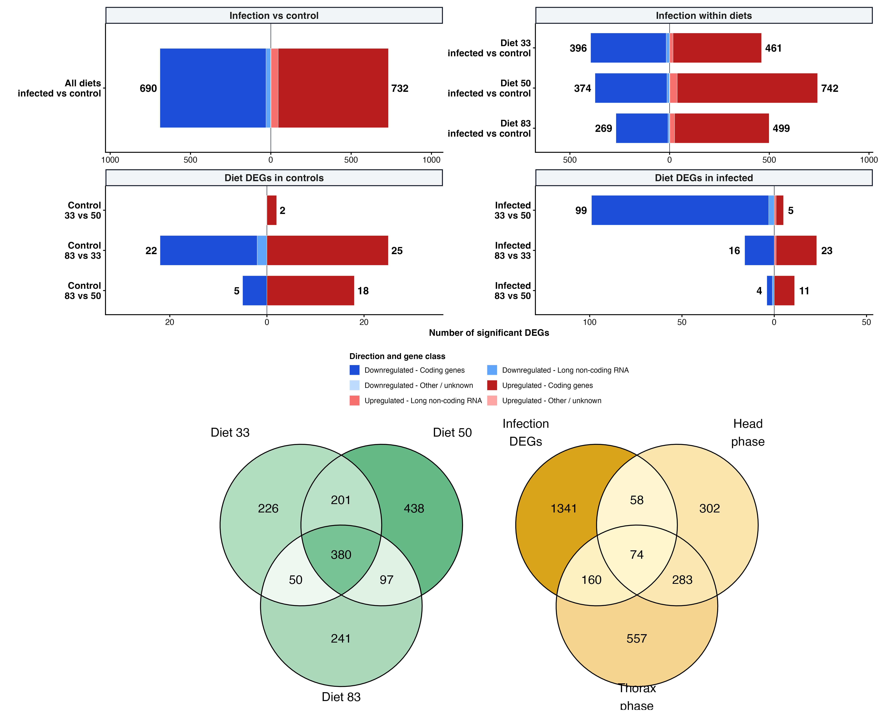

## Purpose

::: {.walkthrough-grid}
::: {.walkthrough-step}
**Step 1 - Build DEG sets**

Collect exact contrast-level chromosome-only gene lists.
:::
::: {.walkthrough-step}
**Step 2 - Measure overlap**

Use Venn, UpSet, and presence-absence summaries to show shared calls.
:::
::: {.walkthrough-step}
**Step 3 - Prioritize genes**

Trace recurrent genes back to the contrasts in which they are significant.
:::
:::

This page compares significant main-chromosome DEG lists from the all-samples
model pages. It also runs the
small condition-specific diet contrasts needed for targeted Venn diagrams:
diet-to-diet DEGs among control samples and diet-to-diet DEGs among infected
samples.

The goal is to ask whether the same genes repeatedly appear across diet
contrasts, infection contrasts, and model coefficients. Genes that recur across
analyses can be useful candidates for follow-up because they are less dependent
on a single contrast definition.

## Setup

The page reads DEG result files from the timestamped run folders produced by the
analysis pages. This keeps the overlap step reproducible while avoiding hidden
helper scripts: the thresholds used to define a DEG remain visible in the YAML
header.

```{r setup}
knitr::opts_chunk$set(message = FALSE, warning = FALSE)

required <- c("DESeq2", "ggplot2", "UpSetR", "ggVennDiagram", "readr", "dplyr")
missing <- required[!vapply(required, requireNamespace, logical(1), quietly = TRUE)]
if (length(missing) > 0) {
  stop("Install required packages before knitting: ", paste(missing, collapse = ", "))
}
library(ggplot2)

diet_colors <- c("33" = "#E6862E", "50" = "#2F8F5B", "83" = "#7B4FA3")
overlap_colors <- c("Present" = "#2F8F5B", "Absent" = "grey92")
bar_color <- "#2F8F5B"

project_dir <- normalizePath(".", mustWork = TRUE)
run_stamp <- format(Sys.time(), "%Y%m%d-%H%M%S")
out_dir <- file.path(project_dir, "output", "rmd_runs",
                     paste(params$output_tag, run_stamp, sep = "_"))
dir.create(out_dir, recursive = TRUE, showWarnings = FALSE)

results_root <- file.path(project_dir, params$results_root)

latest_dir <- function(pattern) {
  dirs <- list.dirs(results_root, recursive = FALSE, full.names = TRUE)
  dirs <- dirs[grepl(pattern, basename(dirs))]
  if (length(dirs) == 0) stop("No run folder matched: ", pattern)
  dirs[which.max(file.info(dirs)$mtime)]
}
```

## Find result files

Only CSV files that look like DESeq2 result tables are selected. The table below
is shown so the reader can see exactly which run outputs contributed to the
overlap analysis.

```{r find-files}
current_run_dirs <- c(
  latest_dir("^exon-only-interaction-model_"),
  latest_dir("^exon-only-diet-pairwise-deg_All_"),
  latest_dir("^exon-only-infection-within-diet-deg_")
)
all_result_files <- unlist(lapply(
  current_run_dirs,
  list.files,
  pattern = "\\.csv$",
  full.names = TRUE
))
all_result_files <- all_result_files[grepl(
  "DESeq2_|all_.*results|coefficients",
  basename(all_result_files)
)]

file_info <- data.frame(
  file = all_result_files,
  short_name = basename(all_result_files),
  modified = file.info(all_result_files)$mtime,
  stringsAsFactors = FALSE
)
file_info <- file_info[order(file_info$short_name,
                             -as.numeric(file_info$modified)), ]

# Keep the newest run for each result table so old workflowR runs do not
# duplicate the same contrast many times in the overlap figures.
file_info <- file_info[!duplicated(file_info$short_name), ]
result_files <- file_info$file

file_table <- data.frame(
  file = result_files,
  short_name = basename(result_files),
  modified = file.info(result_files)$mtime
)

knitr::kable(file_table)
```

## Build DEG sets

Each result table is converted into a set of significant gene IDs. If a table
already contains a `significant` column, that column is used directly; otherwise
the page reconstructs the DEG call from adjusted p-value and log2 fold-change.
This lets the overlap page work with both the current self-contained Rmd outputs
and older result tables.

```{r build-sets}
read_deg_set <- function(path) {
  tab <- read.csv(path, check.names = FALSE)
  gene_col <- intersect(c("gene_id", "gene", "GeneID"), names(tab))[1]
  if (is.na(gene_col)) return(NULL)

  if ("significant" %in% names(tab)) {
    sig <- tab$significant
  } else if (all(c("padj", "log2FoldChange") %in% names(tab))) {
    sig <- !is.na(tab$padj) &
      tab$padj < params$alpha &
      abs(tab$log2FoldChange) >= params$lfc_threshold
  } else {
    return(NULL)
  }

  unique(as.character(tab[[gene_col]][sig]))
}

deg_sets <- lapply(result_files, read_deg_set)
names(deg_sets) <- tools::file_path_sans_ext(basename(result_files))
deg_sets <- deg_sets[lengths(deg_sets) > 0]

set_summary <- data.frame(
  set = names(deg_sets),
  n_genes = lengths(deg_sets),
  stringsAsFactors = FALSE
)
set_summary <- set_summary[order(set_summary$n_genes, decreasing = TRUE), ]
deg_sets <- deg_sets[set_summary$set]

knitr::kable(set_summary)
write.csv(set_summary, file.path(out_dir, "deg_set_summary.csv"),
          row.names = FALSE)
```

## DEG set size plot

This first figure is the fastest way to see which contrasts are driving most of
the DEG signal. It counts each DEG set independently, before asking whether
genes overlap between sets.

```{r deg-set-size-plot, fig.height=5.8, fig.width=9}
set_summary$set <- factor(set_summary$set, levels = rev(set_summary$set))

p_set_size <- ggplot(set_summary, aes(x = set, y = n_genes)) +
  geom_col(fill = bar_color, width = 0.72) +
  geom_text(aes(label = n_genes), hjust = -0.12, size = 3) +
  coord_flip() +
  theme_classic() +
  labs(
    title = "DEG set sizes",
    x = "DEG set",
    y = "Number of significant genes"
  )

p_set_size
ggsave(file.path(out_dir, "deg_set_size_barplot.png"),
       p_set_size, width = 9, height = 5.8, dpi = 300)
```

## Presence-absence matrix

The presence-absence matrix records whether each DEG appears in each result
set. The priority table then lists genes that occur in two or more sets, which
is a practical starting point for annotation, enrichment, and candidate-gene
figures.

```{r overlap-matrix}
if (length(deg_sets) == 0) {
  stop("No DEG sets found. Knit the DESeq2 pages first, then rerun this page.")
}

all_genes <- sort(unique(unlist(deg_sets)))
presence <- sapply(deg_sets, function(x) all_genes %in% x)
presence_df <- data.frame(gene_id = all_genes, presence, check.names = FALSE)

write.csv(presence_df, file.path(out_dir, "deg_presence_absence_matrix.csv"),
          row.names = FALSE)

overlap_count <- rowSums(presence)
names(overlap_count) <- all_genes
priority_genes <- data.frame(
  gene_id = all_genes[overlap_count >= 2],
  n_sets = overlap_count[overlap_count >= 2],
  set_members = apply(presence[overlap_count >= 2, , drop = FALSE], 1,
                      function(x) paste(names(deg_sets)[x], collapse = "; ")),
  stringsAsFactors = FALSE
)
priority_genes <- priority_genes[order(priority_genes$n_sets, decreasing = TRUE), ]

knitr::kable(head(priority_genes, 25))
write.csv(priority_genes, file.path(out_dir, "genes_seen_in_two_or_more_sets.csv"),
          row.names = FALSE)
```

## Intersection size plot

This plot counts overlap patterns directly. A bar means that a group of genes is
shared by exactly the DEG sets named on the y-axis. This is easier to read than
a full gene-by-set heatmap when the result files contain many contrasts.

```{r intersection-size-plot, fig.height=6.5, fig.width=9}
intersection_labels <- apply(presence, 1, function(x) {
  paste(names(deg_sets)[x], collapse = " + ")
})
intersection_labels <- intersection_labels[nzchar(intersection_labels)]
intersection_summary <- as.data.frame(table(intersection = intersection_labels),
                                      stringsAsFactors = FALSE)
names(intersection_summary)[2] <- "n_genes"
intersection_summary$n_sets <- vapply(strsplit(intersection_summary$intersection,
                                               " [+] "),
                                      length, integer(1))
intersection_summary <- intersection_summary[order(intersection_summary$n_genes,
                                                   intersection_summary$n_sets,
                                                   decreasing = TRUE), ]
intersection_summary <- head(intersection_summary, 20)
intersection_summary$intersection_id <- sprintf("I%02d", seq_len(nrow(intersection_summary)))
intersection_summary$intersection_id <- factor(intersection_summary$intersection_id,
                                               levels = rev(intersection_summary$intersection_id))

p_intersections <- ggplot(intersection_summary,
                          aes(x = intersection_id, y = n_genes,
                              fill = factor(n_sets))) +
  geom_col(width = 0.72) +
  geom_text(aes(label = n_genes), hjust = -0.12, size = 3) +
  coord_flip() +
  scale_fill_manual(values = c("1" = "#7B8794", "2" = "#237C8E",
                               "3" = "#5B6B4A", "4" = "#B8643C",
                               "5" = "#8C6D9E", "6" = "#C85A54"),
                    na.value = "#374151") +
  theme_classic() +
  labs(
    title = "Top DEG intersections",
    subtitle = "Bars show exact overlap patterns across the latest DEG result tables",
    x = "Intersection ID",
    y = "Number of genes",
    fill = "Number of sets"
  )

p_intersections
ggsave(file.path(out_dir, "deg_intersection_size_barplot.png"),
       p_intersections, width = 9, height = 6.5, dpi = 300)
write.csv(intersection_summary,
          file.path(out_dir, "deg_intersection_summary.csv"),
          row.names = FALSE)

knitr::kable(intersection_summary[, c("intersection_id", "n_genes",
                                      "n_sets", "intersection")],
             caption = "Intersection IDs used in the plot")
```

## UpSetR plot

The UpSetR panel is the best compact view when there are more than three DEG
sets. To keep the figure readable, this panel uses the largest current DEG sets
from the newest result tables. It is regenerated from the current CSV outputs,
not copied from the older static overlap page.

```{r upsetr-plot, fig.height=7, fig.width=10, results='asis'}
max_upset_sets <- min(10, length(deg_sets))
upset_sets <- deg_sets[seq_len(max_upset_sets)]
names(upset_sets) <- gsub("^DESeq2_", "", names(upset_sets))
names(upset_sets) <- gsub("_", " ", names(upset_sets))

upset_input <- UpSetR::fromList(upset_sets)

png(file.path(out_dir, "deg_upsetr_current_sets.png"),
    width = 3000, height = 2100, res = 300)
UpSetR::upset(
  upset_input,
  nsets = max_upset_sets,
  nintersects = 30,
  order.by = "freq",
  sets.bar.color = bar_color,
  main.bar.color = "#374151",
  matrix.color = "#111827",
  text.scale = c(1.2, 1.2, 0.85, 0.85, 1.1, 0.85)
)
dev.off()

display_dir <- file.path(project_dir, "docs", "figure",
                         "07-deg-overlap-prioritization.Rmd")
dir.create(display_dir, recursive = TRUE, showWarnings = FALSE)
display_png <- file.path(display_dir, "deg-upsetr-current-sets.png")
file.copy(file.path(out_dir, "deg_upsetr_current_sets.png"),
          display_png, overwrite = TRUE)
upset_src <- file.path("figure", "07-deg-overlap-prioritization.Rmd",
                       "deg-upsetr-current-sets.png")

cat(paste0(
  '<p></p>'
))
```

## Venn diagrams

Venn diagrams are easier to interpret for three-set questions. The first panel
compares the infection DEGs found separately in diets 33, 50, and 83. The
second panel summarizes overlap between the broad full-model, diet-pairwise,
and within-diet infection DEG families.

```{r venn-diagrams, fig.height=6, fig.width=12}
get_set <- function(pattern) {
  matched <- names(deg_sets)[grepl(pattern, names(deg_sets))]
  if (length(matched) == 0) {
    return(character())
  }
  unique(unlist(deg_sets[matched], use.names = FALSE))
}

infection_venn_sets <- list(
  "Diet 33" = get_set("infected_vs_control_diet_33$"),
  "Diet 50" = get_set("infected_vs_control_diet_50$"),
  "Diet 83" = get_set("infected_vs_control_diet_83$")
)
infection_venn_sets <- infection_venn_sets[lengths(infection_venn_sets) > 0]

broad_venn_sets <- list(
  "Full model" = get_set("^all_model_coefficients$|^interaction_coefficients$"),
  "Diet pairwise" = get_set("^all_diet_pairwise_results$|^DESeq2_[0-9]+_vs_[0-9]+$"),
  "Within-diet infection" = get_set("^all_infection_within_diet_results$|infected_vs_control_diet")
)
broad_venn_sets <- broad_venn_sets[lengths(broad_venn_sets) > 0]

venn_theme <- ggplot2::theme(
  legend.position = "none",
  plot.title = ggplot2::element_text(face = "bold", hjust = 0.5)
)

plots <- list()
if (length(infection_venn_sets) >= 2) {
  p_infection_venn <- ggVennDiagram::ggVennDiagram(
    infection_venn_sets,
    label = "count",
    label_alpha = 0
  ) +
    ggplot2::scale_fill_gradient(low = "#F7F3E8", high = "#2F8F5B") +
    venn_theme +
    ggplot2::labs(title = "Infection DEGs within diets")
  plots[["infection"]] <- p_infection_venn
  ggplot2::ggsave(file.path(out_dir, "venn_infection_degs_by_diet.png"),
                  p_infection_venn, width = 6, height = 5.4, dpi = 300)
}

if (length(broad_venn_sets) >= 2) {
  p_broad_venn <- ggVennDiagram::ggVennDiagram(
    broad_venn_sets,
    label = "count",
    label_alpha = 0
  ) +
    ggplot2::scale_fill_gradient(low = "#F7F3E8", high = "#7B4FA3") +
    venn_theme +
    ggplot2::labs(title = "Broad DEG families")
  plots[["broad"]] <- p_broad_venn
  ggplot2::ggsave(file.path(out_dir, "venn_broad_deg_families.png"),
                  p_broad_venn, width = 6, height = 5.4, dpi = 300)
}

if (length(plots) == 0) {
  cat("No Venn diagram was drawn because fewer than two matching DEG sets were found.")
} else if (length(plots) == 1) {
  print(plots[[1]])
} else {
  if (requireNamespace("patchwork", quietly = TRUE)) {
    print(plots[[1]] + plots[[2]])
  } else {
    print(plots[[1]])
    print(plots[[2]])
  }
}
```

## Diet DEG Venns within controls and infected samples

The previous diet-pairwise page tests diet differences across all samples while
including infection status as a covariate. Here, we ask a more specific
question: among control samples only, which genes distinguish diets, and among
infected samples only, which genes distinguish diets? Each treatment subset is
modeled separately with `~ Diet`, then the three pairwise diet contrasts are
shown as a Venn diagram.

```{r condition-specific-diet-venns, fig.height=6, fig.width=12}
metadata <- read.delim(file.path(project_dir, params$metadata_file),
                       check.names = FALSE)
metadata$label <- as.character(metadata$label)
metadata$Diet <- factor(metadata$Diet, levels = c("33", "50", "83"))
metadata$Treatment <- factor(metadata$Treatment, levels = c("Control", "Infected"))

counts_table <- readr::read_tsv(file.path(project_dir, params$counts_file),
                                show_col_types = FALSE)
counts <- as.matrix(counts_table[, setdiff(names(counts_table), "gene_id")])
rownames(counts) <- counts_table$gene_id
storage.mode(counts) <- "integer"

count_labels <- sub("_MERGE$", "", sub("^mehreen_", "", colnames(counts)))
metadata <- metadata[match(count_labels, metadata$label), ]
stopifnot(identical(metadata$label, count_labels))
rownames(metadata) <- metadata$label
colnames(counts) <- count_labels

placement <- readr::read_tsv(file.path(project_dir, params$placement_file),
                             show_col_types = FALSE) |>
  dplyr::distinct(gene_id, .keep_all = TRUE)
rrna_ids <- trimws(readLines(file.path(project_dir, params$rrna_file), warn = FALSE))
rrna_ids <- rrna_ids[nzchar(rrna_ids) & !startsWith(rrna_ids, "#")]
main_chromosome_ids <- placement$gene_id[
  placement$sequence_class == "Nuclear chromosome" &
    !placement$gene_id %in% rrna_ids
]
counts <- counts[intersect(rownames(counts), main_chromosome_ids), , drop = FALSE]

run_treatment_diet_degs <- function(treatment_label) {
  keep_samples <- metadata$Treatment == treatment_label
  metadata_sub <- droplevels(metadata[keep_samples, ])
  counts_sub <- counts[, metadata_sub$label, drop = FALSE]
  keep_genes <- rowSums(counts_sub >= params$min_count) >= params$min_samples

  dds <- DESeq2::DESeqDataSetFromMatrix(
    countData = counts_sub[keep_genes, ],
    colData = metadata_sub,
    design = ~ Diet
  )
  dds <- DESeq2::DESeq(dds, minReplicatesForReplace = Inf, quiet = TRUE)

  diet_pairs <- combn(levels(droplevels(metadata_sub$Diet)), 2,
                      simplify = FALSE)
  contrast_sets <- list()
  summary_rows <- list()

  for (pair in diet_pairs) {
    contrast_label <- paste(pair[1], "vs", pair[2], sep = "_")
    res <- DESeq2::results(dds, contrast = c("Diet", pair[1], pair[2]),
                           alpha = params$alpha, cooksCutoff = FALSE)
    res_df <- as.data.frame(res)
    res_df$gene_id <- rownames(res_df)
    res_df$treatment_subset <- treatment_label
    res_df$contrast <- contrast_label
    res_df$significant <- !is.na(res_df$padj) &
      res_df$padj < params$alpha &
      abs(res_df$log2FoldChange) >= params$lfc_threshold
    res_df$direction <- ifelse(res_df$log2FoldChange > 0,
                               paste("Higher in diet", pair[1]),
                               paste("Higher in diet", pair[2]))

    write.csv(
      res_df,
      file.path(out_dir,
                paste0("DESeq2_", treatment_label, "_diet_", contrast_label,
                       ".csv")),
      row.names = FALSE
    )
    writeLines(
      res_df$gene_id[res_df$significant],
      file.path(out_dir,
                paste0("significant_genes_", treatment_label, "_diet_",
                       contrast_label, ".txt"))
    )

    set_name <- paste(pair[1], "vs", pair[2])
    contrast_sets[[set_name]] <- unique(res_df$gene_id[res_df$significant])
    summary_rows[[contrast_label]] <- data.frame(
      treatment_subset = treatment_label,
      contrast = contrast_label,
      n_significant_genes = sum(res_df$significant),
      n_higher_first_diet = sum(res_df$significant & res_df$log2FoldChange > 0,
                                na.rm = TRUE),
      n_higher_second_diet = sum(res_df$significant & res_df$log2FoldChange < 0,
                                 na.rm = TRUE),
      stringsAsFactors = FALSE
    )
  }

  list(
    sets = contrast_sets,
    summary = do.call(rbind, summary_rows)
  )
}

control_diet_degs <- run_treatment_diet_degs("Control")
infected_diet_degs <- run_treatment_diet_degs("Infected")

condition_diet_summary <- rbind(control_diet_degs$summary,
                                infected_diet_degs$summary)
knitr::kable(condition_diet_summary,
             caption = "Diet-pairwise DEGs run separately within controls and infected samples")
write.csv(condition_diet_summary,
          file.path(out_dir, "condition_specific_diet_pairwise_summary.csv"),
          row.names = FALSE)

make_condition_venn <- function(sets, title, high_color, file_name) {
  sets <- sets[lengths(sets) > 0]
  if (length(sets) < 2) {
    return(NULL)
  }
  p <- ggVennDiagram::ggVennDiagram(
    sets,
    label = "count",
    label_alpha = 0
  ) +
    ggplot2::scale_fill_gradient(low = "#F7F3E8", high = high_color) +
    venn_theme +
    ggplot2::labs(title = title)
  ggplot2::ggsave(file.path(out_dir, file_name), p,
                  width = 6, height = 5.4, dpi = 300)
  p
}

p_control_diet_venn <- make_condition_venn(
  control_diet_degs$sets,
  "Diet DEGs among controls",
  "#2F8F5B",
  "venn_diet_degs_controls.png"
)

p_infected_diet_venn <- make_condition_venn(
  infected_diet_degs$sets,
  "Diet DEGs among infected samples",
  "#7B4FA3",
  "venn_diet_degs_infected.png"
)

condition_venn_plots <- Filter(Negate(is.null),
                               list(p_control_diet_venn, p_infected_diet_venn))
if (length(condition_venn_plots) == 0) {
  cat("No condition-specific diet Venn diagram was drawn because fewer than two DEG sets were found.")
} else if (length(condition_venn_plots) == 1) {
  print(condition_venn_plots[[1]])
} else {
  if (requireNamespace("patchwork", quietly = TRUE)) {
    print(condition_venn_plots[[1]] + condition_venn_plots[[2]])
  } else {
    print(condition_venn_plots[[1]])
    print(condition_venn_plots[[2]])
  }
}
```

## Overlap plot

The heatmap displays the densest part of the presence-absence matrix so the
website stays readable. Blue cells mean the gene is significant in that DEG set;
grey cells mean it is absent from that set under the current thresholds.

```{r overlap-plot, fig.height=8, fig.width=10}
set_display_names <- names(deg_sets)
set_display_names <- gsub("^DESeq2_", "", set_display_names)
set_display_names <- gsub("_", " ", set_display_names)
set_display_names <- gsub("infected vs control diet", "Infection diet",
                          set_display_names)
set_display_names <- gsub("diet effect", "Diet effect", set_display_names)

plot_df <- data.frame(
  gene_id = rep(all_genes, times = length(deg_sets)),
  set = rep(set_display_names, each = length(all_genes)),
  present = as.vector(presence)
)

# Plot the densest part of the matrix so the website stays readable.
top_genes <- names(sort(overlap_count, decreasing = TRUE))[seq_len(min(60, length(overlap_count)))]
plot_df <- plot_df[plot_df$gene_id %in% top_genes, ]
gene_order <- names(sort(overlap_count[top_genes], decreasing = FALSE))
plot_df$gene_id <- factor(plot_df$gene_id, levels = gene_order)
plot_df$set <- factor(plot_df$set, levels = set_display_names)

p_overlap <- ggplot2::ggplot(plot_df,
                             ggplot2::aes(x = set, y = gene_id, fill = present)) +
  ggplot2::geom_tile(color = "white", linewidth = 0.18) +
  ggplot2::scale_fill_manual(values = c("TRUE" = overlap_colors[["Present"]],
                                        "FALSE" = overlap_colors[["Absent"]]),
                             labels = c("TRUE" = "Present",
                                        "FALSE" = "Absent")) +
  ggplot2::theme_classic() +
  ggplot2::theme(axis.text.x = ggplot2::element_text(angle = 45, hjust = 1),
                 axis.text.y = ggplot2::element_text(size = 5),
                 axis.ticks.y = ggplot2::element_blank(),
                 legend.position = "bottom") +
  ggplot2::labs(
    title = "DEG overlap matrix",
    subtitle = "Top genes ranked by number of DEG sets where they appear",
    x = "DEG set",
    y = "Gene",
    fill = "Present"
  )

p_overlap
ggplot2::ggsave(file.path(out_dir, "deg_overlap_matrix.png"),
                p_overlap, width = 10, height = 8, dpi = 300)
```

## Publication figure {#Publication_figure}

Figure 2 combines the exact placed-chromosome DEG burden with overlap among
the diet, infection, and shared phase-reference contexts. Its underlying gene
sets are built on this page and in the linked all-sample DEG catalogue.



The full-size PNG/SVG exports and the membership tables are collected on the
[publication figure page](08-publication-figures.html#Figure_2:_DEG_burden,_context_overlap,_and_phase-reference_overlap).

```{r session-info}
writeLines(capture.output(sessionInfo()),
           file.path(out_dir, "sessionInfo.txt"))
sessionInfo()
```
