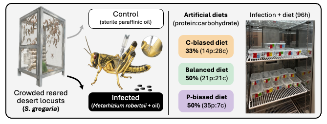

fat body RNA-seq / diet / fungal challenge

<h1>Fat body diet-infection RNA-seq analysis</h1>

Follow how dietary protein-to-carbohydrate balance relates to the fat body
transcriptional response of <em>Schistocerca gregaria</em> to
<em>Metarhizium robertsii</em>. The site moves from experimental design and
quality control to differential expression, functional interpretation, and
publication figures.

<a href="01-study-design-data.html">Start with the study</a>
<a href="28-placed-unplaced-scaffold-analysis.html">Read the results</a>
<a href="08-publication-figures.html">View the figures</a>

## Follow the analysis

  <a class="analysis-tile" href="01-study-design-data.html">
    1
    <strong>Design and quality control</strong>
    Understand the diets, infection treatment, sample cohort, mapping, and count filtering.
  </a>
  <a class="analysis-tile" href="28-placed-unplaced-scaffold-analysis.html">
    2
    <strong>Primary differential expression</strong>
    Follow the manuscript analysis and the placement sensitivity that defines its gene universe.
  </a>
  <a class="analysis-tile" href="10-go-term-enrichment.html">
    3
    <strong>Functional interpretation</strong>
    Connect infection-responsive genes to GO terms, KEGG pathways, expression clusters, and candidates.
  </a>
  <a class="analysis-tile" href="08-publication-figures.html">
    4
    <strong>Publication figures</strong>
    Review and download the main and supplementary figure panels with their source tables.
  </a>

<strong>Primary analysis.</strong> The manuscript path uses the 44 QC-passed
libraries, transcript-plus-exon gene counts, annotated rRNA removal, and genes
assigned to the nuclear chromosomes. All-scaffold, exon-only, sample-exclusion,
and sequence-origin checks are grouped under <a href="35-count-definition-sensitivity.html">Validation</a>.

Every analysis page contains its runnable R code. Data locations and rerun
commands are documented on the <a href="02-workflow-reproducibility.html">workflow and reproducibility page</a>.

